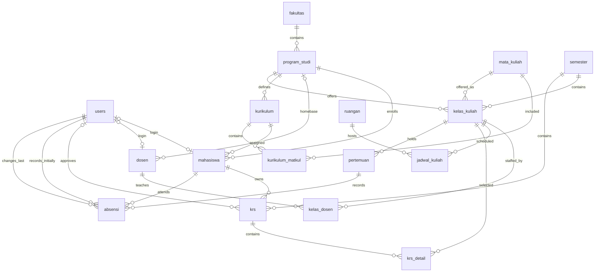

# Kampusia database design

This document is the source of truth for the database design. The existing 15-table PostgreSQL model is implemented in `packages/db/schema/`, with its initial migration in `packages/db/migrations/0000_initial.sql`. That migration was applied and verified on the local Podman development database on 2026-09-05; migration state is specific to each database. The `pertemuan` and `absensi` extension documented below is design-only and is not yet present in the Drizzle schema or a migration. Changes to the model must update this document before implementation. See [database package notes](../packages/db/README.md) for verification commands and the boundary between database constraints and future service rules.

The design covers the 17 tables below. The initial 15-table academic model is extended here with `pertemuan` and `absensi`; assessment components, grades, and other future modules require separate documented extensions.

## Shared conventions

- All table, column, constraint, and index names use snake_case.
- Every table, including junction tables, has an `id uuid PRIMARY KEY DEFAULT gen_random_uuid()`.
- Every table has non-null `created_at timestamptz DEFAULT now()` and `updated_at timestamptz DEFAULT now()`. The service updates `updated_at` on every mutation; its default alone does not update existing rows.
- Column tables below include these shared columns. “No” in Nullable means `NOT NULL`. A dash in Default means no database default; a required value must be supplied.
- Foreign keys reference the target table's `id` unless a composite reference is explicitly documented, with `ON DELETE RESTRICT ON UPDATE RESTRICT` in either case. No cascading deletion is planned. Retain academic history; deactivate or cancel referenced records instead of deleting them.
- Primary keys and unique constraints provide their own indexes. Additional indexes listed below are B-tree unless specified. Do not add duplicate indexes on the same keys. Composite indexes also serve lookups on their leading column.
- Nullable unique columns allow multiple nulls; any supplied non-null value must be unique.
- Business codes and identifiers are text, preserving leading zeros. Trim input; normalize codes and identifiers to uppercase and login email to lowercase before persistence. Require nonblank values for required text fields, and reject blank optional text in favor of null. Database checks must enforce canonical storage for unique codes, identifiers, and email.
- Status, role, jenjang, and jenis columns use the documented PostgreSQL varchar type with a CHECK limiting values to the listed set. These are initial product choices, not statutory requirements.
- Local weekly schedule times use the campus timezone, initially Asia/Jakarta. Instants such as submission timestamps use timestamptz.
- Database constraints enforce row-local validity, uniqueness, and references, including the documented composite foreign key enforcing student/curriculum program compatibility. Services enforce remaining cross-table rules and authorization inside transactions; single-column foreign keys alone do not enforce semester, program, curriculum, or role compatibility.
- Paginate list queries. Initial indexes support identifiers and common relationships; add name-search indexes only after defining and measuring the actual search pattern.

## Relationship overview



Each student's faculty is derived through program_studi. Course membership and recommended semester belong in kurikulum_matkul. Students select semester-specific offerings through krs and krs_detail. Lecturer assignments use kelas_dosen, including team teaching. Actual class meetings belong to kelas_kuliah, and attendance joins each meeting directly to a student. Semester, course, program, and class are derived through the meeting's class rather than copied into attendance.

## Table definitions

### users

Authentication accounts, separate from student and lecturer academic profiles.

| Column | PostgreSQL type | Nullable | Default | Meaning / reference |
| --- | --- | --- | --- | --- |
| `id` | `uuid` | No | gen_random_uuid() | Primary key |
| `email` | `varchar(254)` | No | — | Canonical lowercase login email |
| `password_hash` | `text` | No | — | Secure password hash; never plaintext |
| `role` | `varchar(16)` | No | — | ADMIN, AKADEMIK, DOSEN, or MAHASISWA |
| `is_active` | `boolean` | No | true | Whether login is permitted |
| `created_at` | `timestamptz` | No | now() | Creation instant |
| `updated_at` | `timestamptz` | No | now() | Last mutation instant |

**Primary key:** `id`.

**Foreign keys:** None.

**Unique constraints:** `UNIQUE (email)`.

**Additional indexes:** None beyond primary/unique indexes.

**Business rules:**

- An account has one role in the initial design. ADMIN and AKADEMIK accounts need no academic profile.
- A linked mahasiswa account must have role MAHASISWA; a linked dosen account must have role DOSEN. Services prevent incompatible links and role changes.
- An account may be linked to at most one student or one lecturer, never both. The per-table unique constraints do not enforce the cross-table exclusion; account linking must lock the users row and validate it.
- Disabling a login does not cancel academic records. Never expose password_hash in API responses.

**Relationships:** Optional one-to-one links from mahasiswa and dosen; one-to-many KRS approvals; one-to-many initial and latest attendance-recording references.

### fakultas

Faculty master data.

| Column | PostgreSQL type | Nullable | Default | Meaning / reference |
| --- | --- | --- | --- | --- |
| `id` | `uuid` | No | gen_random_uuid() | Primary key |
| `kode` | `varchar(20)` | No | — | Institution-wide faculty code |
| `nama` | `varchar(150)` | No | — | Faculty name |
| `is_active` | `boolean` | No | true | Available for new academic setup |
| `created_at` | `timestamptz` | No | now() | Creation instant |
| `updated_at` | `timestamptz` | No | now() | Last mutation instant |

**Primary key:** `id`.

**Foreign keys:** None.

**Unique constraints:** `UNIQUE (kode)`.

**Additional indexes:** None beyond primary/unique indexes.

**Business rules:**

- Deactivation retains programs and academic history. Services must reject new active program assignments to an inactive faculty.

**Relationships:** One faculty has many program_studi.

### program_studi

Study programs within faculties.

| Column | PostgreSQL type | Nullable | Default | Meaning / reference |
| --- | --- | --- | --- | --- |
| `id` | `uuid` | No | gen_random_uuid() | Primary key |
| `fakultas_id` | `uuid` | No | — | FK fakultas.id |
| `kode` | `varchar(20)` | No | — | Institution-wide study program code |
| `nama` | `varchar(150)` | No | — | Study program name |
| `jenjang` | `varchar(12)` | No | — | D1, D2, D3, D4, S1, S2, S3, or PROFESI |
| `is_active` | `boolean` | No | true | Available for new assignments |
| `created_at` | `timestamptz` | No | now() | Creation instant |
| `updated_at` | `timestamptz` | No | now() | Last mutation instant |

**Primary key:** `id`.

**Foreign keys:** `fakultas_id` → fakultas.id.

**Unique constraints:** `UNIQUE (kode)`.

**Additional indexes:** `(fakultas_id)`.

**Business rules:**

- Every program belongs to exactly one faculty. Do not duplicate fakultas_id in mahasiswa.
- Inactive programs retain students, curricula, lecturers, and historical offerings; reject new assignments to them.
- Changing faculty is an administrative correction and must not silently change the intended historical meaning of existing data.

**Relationships:** Many programs belong to one faculty; a program has many students, curricula, offerings, and optional lecturer homebases.

### mahasiswa

Student academic identity and assigned curriculum.

| Column | PostgreSQL type | Nullable | Default | Meaning / reference |
| --- | --- | --- | --- | --- |
| `id` | `uuid` | No | gen_random_uuid() | Primary key |
| `user_id` | `uuid` | Yes | — | FK users.id |
| `program_studi_id` | `uuid` | No | — | FK program_studi.id |
| `kurikulum_id` | `uuid` | No | — | Part of composite FK (kurikulum_id, program_studi_id) to kurikulum (id, program_studi_id) |
| `nim` | `varchar(30)` | No | — | Student business identifier |
| `nama` | `varchar(150)` | No | — | Student full name |
| `angkatan` | `smallint` | No | — | Entry year |
| `status` | `varchar(16)` | No | AKTIF | AKTIF, CUTI, LULUS, KELUAR, or NONAKTIF |
| `created_at` | `timestamptz` | No | now() | Creation instant |
| `updated_at` | `timestamptz` | No | now() | Last mutation instant |

**Primary key:** `id`.

**Foreign keys:** `user_id` → users.id; `program_studi_id` → program_studi.id; `FOREIGN KEY (kurikulum_id, program_studi_id) REFERENCES kurikulum (id, program_studi_id) ON DELETE RESTRICT ON UPDATE RESTRICT`. The composite reference replaces the single-column kurikulum_id foreign key; both participating columns are NOT NULL.

**Unique constraints:** `UNIQUE (nim)` and `UNIQUE (user_id)`. NIM is not a primary key.

**Additional indexes:** `(program_studi_id, angkatan)` and `(kurikulum_id)`.

**Business rules:**

- CHECK angkatan BETWEEN 1900 AND 9999.
- An academic record may exist before a login account is provisioned.
- Assigned curriculum must belong to the student's program. PostgreSQL enforces this on inserts and updates through the composite foreign key to kurikulum; service validation may provide a clearer error but is not the integrity guarantee. The referenced curriculum's program cannot change while student references would become invalid. Only AKTIF students may submit or obtain approval for new KRS.
- Program or curriculum reassignment requires explicit academic review; do not reinterpret approved KRS history. The initial design does not model transfer history.

**Relationships:** Belongs to one program and one curriculum, optionally one user; has many KRS, one per semester, and many attendance rows across meetings.

### dosen

Lecturer identity, independent of class assignments.

| Column | PostgreSQL type | Nullable | Default | Meaning / reference |
| --- | --- | --- | --- | --- |
| `id` | `uuid` | No | gen_random_uuid() | Primary key |
| `user_id` | `uuid` | Yes | — | FK users.id |
| `program_studi_id` | `uuid` | Yes | — | FK program_studi.id |
| `kode_dosen` | `varchar(30)` | No | — | Institution-issued lecturer identifier |
| `nidn` | `varchar(30)` | Yes | — | National lecturer identifier when available |
| `nama` | `varchar(150)` | No | — | Lecturer full name |
| `is_active` | `boolean` | No | true | Available for new teaching assignments |
| `created_at` | `timestamptz` | No | now() | Creation instant |
| `updated_at` | `timestamptz` | No | now() | Last mutation instant |

**Primary key:** `id`.

**Foreign keys:** `user_id` → users.id; `program_studi_id` → program_studi.id.

**Unique constraints:** `UNIQUE (kode_dosen)`, `UNIQUE (nidn)`, and `UNIQUE (user_id)`. Lecturer identifiers are not primary keys.

**Additional indexes:** `(program_studi_id)`.

**Business rules:**

- kode_dosen identifies every lecturer locally; nidn is optional to accommodate lecturers without that identifier. Each supplied identifier is unique in its own column.
- Homebase is optional and does not restrict teaching in other programs.
- Inactive lecturers retain historical assignments and cannot receive new assignments.

**Relationships:** Optional user and homebase program; many-to-many with kelas_kuliah through kelas_dosen.

### semester

Explicit academic terms and the globally selected active term.

| Column | PostgreSQL type | Nullable | Default | Meaning / reference |
| --- | --- | --- | --- | --- |
| `id` | `uuid` | No | gen_random_uuid() | Primary key |
| `kode` | `varchar(5)` | No | — | YYYY1 for Ganjil or YYYY2 for Genap |
| `nama` | `varchar(100)` | No | — | Display name, e.g. Ganjil 2026/2027 |
| `tahun_mulai` | `smallint` | No | — | First year of academic year |
| `jenis` | `varchar(8)` | No | — | GANJIL or GENAP |
| `tanggal_mulai` | `date` | No | — | Term start date |
| `tanggal_selesai` | `date` | No | — | Term end date |
| `is_active` | `boolean` | No | false | Explicit active-term selection |
| `created_at` | `timestamptz` | No | now() | Creation instant |
| `updated_at` | `timestamptz` | No | now() | Last mutation instant |

**Primary key:** `id`.

**Foreign keys:** None.

**Unique constraints:** `UNIQUE (kode)` and `UNIQUE (tahun_mulai, jenis)`; unique partial index `(is_active) WHERE is_active = true` permits at most one active term.

**Additional indexes:** None beyond primary/unique indexes.

**Business rules:**

- CHECK tahun_mulai BETWEEN 1900 AND 9998 and tanggal_mulai <= tanggal_selesai.
- CHECK kode matches tahun_mulai followed by 1 for GANJIL or 2 for GENAP. The initial model has two regular terms per academic year.
- Dates do not determine is_active. Switch the active term in one transaction. Zero active terms are allowed during setup; KRS submission requires one.
- Do not alter term identity or dates once doing so would invalidate approved enrollments, schedules, or actual meetings. A meeting date must remain within its owning term.

**Relationships:** One semester has many offerings and KRS.

### mata_kuliah

Reusable course catalog records.

| Column | PostgreSQL type | Nullable | Default | Meaning / reference |
| --- | --- | --- | --- | --- |
| `id` | `uuid` | No | gen_random_uuid() | Primary key |
| `kode` | `varchar(30)` | No | — | Institution-wide course code |
| `nama` | `varchar(150)` | No | — | Course name |
| `sks` | `smallint` | No | — | Course credit value |
| `is_active` | `boolean` | No | true | Available for new offerings and curriculum membership |
| `created_at` | `timestamptz` | No | now() | Creation instant |
| `updated_at` | `timestamptz` | No | now() | Last mutation instant |

**Primary key:** `id`.

**Foreign keys:** None.

**Unique constraints:** `UNIQUE (kode)`.

**Additional indexes:** None beyond primary/unique indexes.

**Business rules:**

- CHECK sks > 0.
- Do not store recommended semester or kurikulum_id here. One course can belong to multiple curricula through kurikulum_matkul.
- Treat sks and academic identity as immutable once used by an offering or assigned curriculum. A change in credit value requires a new catalog version with a distinct code, preserving historical credit calculations.

**Relationships:** Many curriculum memberships and semester-specific offerings.

### kurikulum

A version of a study program's curriculum.

| Column | PostgreSQL type | Nullable | Default | Meaning / reference |
| --- | --- | --- | --- | --- |
| `id` | `uuid` | No | gen_random_uuid() | Primary key |
| `program_studi_id` | `uuid` | No | — | FK program_studi.id |
| `kode` | `varchar(30)` | No | — | Curriculum code within program |
| `nama` | `varchar(150)` | No | — | Curriculum name |
| `tahun_berlaku` | `smallint` | No | — | Starting curriculum year |
| `is_active` | `boolean` | No | true | Available for new student assignment |
| `created_at` | `timestamptz` | No | now() | Creation instant |
| `updated_at` | `timestamptz` | No | now() | Last mutation instant |

**Primary key:** `id`.

**Foreign keys:** `program_studi_id` → program_studi.id.

**Unique constraints:** `UNIQUE (program_studi_id, kode)` and `UNIQUE (id, program_studi_id)`. The latter supplies the composite unique key referenced by mahasiswa, even though id remains the UUID primary key.

**Additional indexes:** None beyond primary/unique indexes; the unique index on (program_studi_id, kode) covers program_studi_id, and UNIQUE (id, program_studi_id) supplies its own index for the composite reference.

**Business rules:**

- CHECK tahun_berlaku BETWEEN 1900 AND 9999.
- Multiple curriculum versions may remain active for different cohorts. Deactivation prevents new assignments but does not invalidate existing students.
- Once assigned to students, preserve membership and academic requirements; create a new curriculum version for substantive changes.

**Relationships:** Belongs to one program; has many assigned students and kurikulum_matkul entries.

### kurikulum_matkul

Course membership and placement within a curriculum.

| Column | PostgreSQL type | Nullable | Default | Meaning / reference |
| --- | --- | --- | --- | --- |
| `id` | `uuid` | No | gen_random_uuid() | Primary key |
| `kurikulum_id` | `uuid` | No | — | FK kurikulum.id |
| `mata_kuliah_id` | `uuid` | No | — | FK mata_kuliah.id |
| `semester_rekomendasi` | `smallint` | Yes | — | Recommended study semester; null means unspecified |
| `is_wajib` | `boolean` | No | true | Required course rather than elective |
| `created_at` | `timestamptz` | No | now() | Creation instant |
| `updated_at` | `timestamptz` | No | now() | Last mutation instant |

**Primary key:** `id`.

**Foreign keys:** `kurikulum_id` → kurikulum.id; `mata_kuliah_id` → mata_kuliah.id.

**Unique constraints:** `UNIQUE (kurikulum_id, mata_kuliah_id)`.

**Additional indexes:** `(mata_kuliah_id)`; the unique index covers kurikulum_id.

**Business rules:**

- CHECK semester_rekomendasi IS NULL OR semester_rekomendasi > 0.
- A recommendation is not an eligibility prohibition. Elective and required membership both use this junction.
- Do not duplicate course name or SKS here. Refer to the catalog; preserve assigned curriculum versions.

**Relationships:** Joins kurikulum and mata_kuliah in a many-to-many relationship.

### kelas_kuliah

A course offering by a program in a particular academic semester.

| Column | PostgreSQL type | Nullable | Default | Meaning / reference |
| --- | --- | --- | --- | --- |
| `id` | `uuid` | No | gen_random_uuid() | Primary key |
| `semester_id` | `uuid` | No | — | FK semester.id |
| `mata_kuliah_id` | `uuid` | No | — | FK mata_kuliah.id |
| `program_studi_id` | `uuid` | No | — | FK program_studi.id |
| `nama_kelas` | `varchar(20)` | No | — | Class label, e.g. A |
| `kapasitas` | `integer` | No | — | Maximum approved active enrollments |
| `status` | `varchar(16)` | No | DRAFT | DRAFT, DIBUKA, DITUTUP, or DIBATALKAN |
| `created_at` | `timestamptz` | No | now() | Creation instant |
| `updated_at` | `timestamptz` | No | now() | Last mutation instant |

**Primary key:** `id`.

**Foreign keys:** `semester_id` → semester.id; `mata_kuliah_id` → mata_kuliah.id; `program_studi_id` → program_studi.id.

**Unique constraints:** `UNIQUE (semester_id, program_studi_id, mata_kuliah_id, nama_kelas)`.

**Additional indexes:** `(mata_kuliah_id)`, `(program_studi_id)`, and `(semester_id, status)`.

**Business rules:**

- CHECK kapasitas > 0. Never store jumlah_mahasiswa; derive enrollment counts as defined below.
- Before DIBUKA, require an active program/course, at least one active lecturer assignment, and at least one valid conflict-free schedule.
- Before DIBUKA, the service must also verify that the class's mata_kuliah belongs to at least one curriculum for its offering program_studi: a kurikulum_matkul row must match kelas_kuliah.mata_kuliah_id and join to a kurikulum whose program_studi_id equals kelas_kuliah.program_studi_id. This is required for opening a class in the initial system.
- DIBUKA accepts selections and approvals. DITUTUP prevents new enrollment while existing enrollments remain valid. DIBATALKAN requires transactional cancellation of related active details and any remaining TERJADWAL meetings; completed meetings and attendance remain historical.
- Do not change semester, course, or offering program after selections exist. Capacity reductions must not fall below approved active enrollment count.
- Initial enrollment is limited to the student's program and curriculum membership; cross-program enrollment requires a documented design extension.

**Relationships:** Belongs to a semester, course, and program; has many schedules, lecturer assignments, KRS details, and meetings.

### kelas_dosen

Lecturer assignments supporting team teaching.

| Column | PostgreSQL type | Nullable | Default | Meaning / reference |
| --- | --- | --- | --- | --- |
| `id` | `uuid` | No | gen_random_uuid() | Primary key |
| `kelas_kuliah_id` | `uuid` | No | — | FK kelas_kuliah.id |
| `dosen_id` | `uuid` | No | — | FK dosen.id |
| `is_koordinator` | `boolean` | No | false | Primary coordinating lecturer |
| `created_at` | `timestamptz` | No | now() | Creation instant |
| `updated_at` | `timestamptz` | No | now() | Last mutation instant |

**Primary key:** `id`.

**Foreign keys:** `kelas_kuliah_id` → kelas_kuliah.id; `dosen_id` → dosen.id.

**Unique constraints:** `UNIQUE (kelas_kuliah_id, dosen_id)`; unique partial index `(kelas_kuliah_id) WHERE is_koordinator = true` allows at most one coordinator.

**Additional indexes:** `(dosen_id)`; unique indexes cover kelas_kuliah_id.

**Business rules:**

- One class may have many lecturers and one lecturer may teach many classes. A coordinator is optional.
- All assigned lecturers are assumed to attend every weekly schedule of the class in this initial model.
- Adding or changing an assignment must revalidate lecturer schedule conflicts. Preserve at least one lecturer on an opened class.

**Relationships:** Joins kelas_kuliah and dosen in a many-to-many relationship.

### ruangan

Teaching rooms used by weekly schedules.

| Column | PostgreSQL type | Nullable | Default | Meaning / reference |
| --- | --- | --- | --- | --- |
| `id` | `uuid` | No | gen_random_uuid() | Primary key |
| `kode` | `varchar(30)` | No | — | Institution-wide room code |
| `nama` | `varchar(100)` | No | — | Room name |
| `gedung` | `varchar(100)` | Yes | — | Building label |
| `kapasitas` | `integer` | No | — | Maximum occupants for a teaching class |
| `is_active` | `boolean` | No | true | Available for new scheduling |
| `created_at` | `timestamptz` | No | now() | Creation instant |
| `updated_at` | `timestamptz` | No | now() | Last mutation instant |

**Primary key:** `id`.

**Foreign keys:** None.

**Unique constraints:** `UNIQUE (kode)`.

**Additional indexes:** None beyond primary/unique indexes.

**Business rules:**

- CHECK kapasitas > 0.
- Every scheduled room must accommodate kelas_kuliah.kapasitas. Reducing room capacity requires checking existing schedules.
- Inactive rooms retain history; deactivation requires resolving current/future schedules before taking effect.

**Relationships:** One room has many schedules at nonconflicting times.

### jadwal_kuliah

Recurring weekly room/time slots for a class over its semester dates.

| Column | PostgreSQL type | Nullable | Default | Meaning / reference |
| --- | --- | --- | --- | --- |
| `id` | `uuid` | No | gen_random_uuid() | Primary key |
| `kelas_kuliah_id` | `uuid` | No | — | FK kelas_kuliah.id |
| `ruangan_id` | `uuid` | No | — | FK ruangan.id |
| `hari` | `smallint` | No | — | 1 = Monday through 7 = Sunday |
| `jam_mulai` | `time without time zone` | No | — | Local start time |
| `jam_selesai` | `time without time zone` | No | — | Local end time |
| `created_at` | `timestamptz` | No | now() | Creation instant |
| `updated_at` | `timestamptz` | No | now() | Last mutation instant |

**Primary key:** `id`.

**Foreign keys:** `kelas_kuliah_id` → kelas_kuliah.id; `ruangan_id` → ruangan.id.

**Unique constraints:** `UNIQUE (kelas_kuliah_id, hari, jam_mulai, jam_selesai)` prevents duplicate class slots.

**Additional indexes:** `(ruangan_id, hari, jam_mulai)`; the unique index covers kelas_kuliah_id.

**Business rules:**

- CHECK hari BETWEEN 1 AND 7 and jam_mulai < jam_selesai. Overnight slots must be split into separate days.
- Services must check room, class, and every assigned lecturer for overlap; uniqueness does not detect partial overlaps.
- Conflict rules apply across semesters with overlapping date ranges, not merely equal semester_id. See concurrency and schedule rules below.
- The initial model requires a physical room; virtual classes and per-date exceptions are outside this design.

**Relationships:** Belongs to one class and one room; lecturers and semester are derived from the class.

### pertemuan

An actual class meeting. It records what occurred or was planned for one date independently of the class's recurring weekly jadwal_kuliah slots.

| Column | PostgreSQL type | Nullable | Default | Meaning / reference |
| --- | --- | --- | --- | --- |
| `id` | `uuid` | No | gen_random_uuid() | Primary key |
| `kelas_kuliah_id` | `uuid` | No | — | FK kelas_kuliah.id |
| `nomor_pertemuan` | `smallint` | No | — | Positive sequence number within the class |
| `tanggal` | `date` | No | — | Actual or planned local meeting date |
| `jam_mulai` | `time without time zone` | No | — | Actual or planned local start time |
| `jam_selesai` | `time without time zone` | No | — | Actual or planned local end time |
| `materi` | `text` | Yes | — | Topic or material; null while not yet specified |
| `status` | `varchar(16)` | No | TERJADWAL | TERJADWAL, SELESAI, or DIBATALKAN |
| `created_at` | `timestamptz` | No | now() | Creation instant |
| `updated_at` | `timestamptz` | No | now() | Last mutation or factual-correction instant |

**Primary key:** `id`.

**Foreign keys:** `kelas_kuliah_id` → kelas_kuliah.id.

**Unique constraints:** `UNIQUE (kelas_kuliah_id, nomor_pertemuan)`, including cancelled meetings. Cancelling a meeting does not release its number for reuse.

**Additional indexes:** `(tanggal, status)` supports date-oriented operational lists; the unique index covers class-scoped meeting lists and lookups.

**CHECK constraints:**

- `nomor_pertemuan > 0`.
- `jam_mulai < jam_selesai`; an overnight meeting must be represented as separate records or by a future documented extension.
- `status IN ('TERJADWAL', 'SELESAI', 'DIBATALKAN')`.
- `materi IS NULL` or contains at least one non-whitespace character.

**Business rules:**

- A meeting belongs to exactly one class. Do not store semester_id, mata_kuliah_id, program_studi_id, or recurring jadwal_kuliah values here; derive them through kelas_kuliah.
- tanggal and times are the actual/planned occurrence and need not equal any recurring jadwal_kuliah weekday or time. A make-up meeting may therefore differ from the weekly schedule, but tanggal must remain within the owning class's semester date range. This cross-table date rule is enforced by the service. The table does not reserve a room or lecturer and does not perform resource-conflict detection; actual-room/resource tracking requires a separately reviewed extension.
- Meetings may normally be created only for DIBUKA or DITUTUP classes. DRAFT classes are not yet teaching, and DIBATALKAN classes cannot receive new meetings.
- TERJADWAL may transition to SELESAI or DIBATALKAN. DIBATALKAN is terminal and remains historical. SELESAI is terminal for normal workflow operations.
- Completing a meeting requires explicit attendance coverage for every student effectively enrolled at finalization time; an empty effective roster is valid. Completion and attendance finalization are one transaction.
- Class cancellation must cancel its remaining TERJADWAL meetings in the same transaction. Existing SELESAI meetings and all attendance remain unchanged.
- Ordinary edits to a SELESAI meeting are prohibited. An explicit authorized factual correction may change tanggal, times, or materi after revalidation, but never kelas_kuliah_id, nomor_pertemuan, or status. The initial model retains the corrected value and mutation timestamp, not every previous value.

**Relationships:** Belongs to one kelas_kuliah and has many absensi rows. Semester, course, program, schedules, and lecturers are derived through the class.

**Retention/history behavior:** A DIBATALKAN or SELESAI meeting is never hard-deleted. Hard deletion is limited to an unreferenced TERJADWAL setup mistake with no attendance; otherwise cancel it. Completed history remains even if the class or an associated enrollment is later closed or cancelled.

### absensi

One student's attendance result for one actual meeting.

| Column | PostgreSQL type | Nullable | Default | Meaning / reference |
| --- | --- | --- | --- | --- |
| `id` | `uuid` | No | gen_random_uuid() | Primary key |
| `pertemuan_id` | `uuid` | No | — | FK pertemuan.id |
| `mahasiswa_id` | `uuid` | No | — | FK mahasiswa.id |
| `status` | `varchar(8)` | No | — | HADIR, IZIN, SAKIT, or ALPHA; always explicit |
| `keterangan` | `text` | Yes | — | Optional attendance or correction note |
| `dicatat_oleh` | `uuid` | No | — | FK users.id; account that first recorded the row |
| `diubah_oleh` | `uuid` | No | — | FK users.id; account that most recently wrote the row, initially equal to dicatat_oleh |
| `created_at` | `timestamptz` | No | now() | Initial recording instant; unchanged by correction |
| `updated_at` | `timestamptz` | No | now() | Most recent correction instant |

**Primary key:** `id`.

**Foreign keys:** `pertemuan_id` → pertemuan.id; `mahasiswa_id` → mahasiswa.id; `dicatat_oleh` → users.id; `diubah_oleh` → users.id.

**Unique constraints:** `UNIQUE (pertemuan_id, mahasiswa_id)`. One student has at most one current attendance result per meeting, including after KRS changes.

**Additional indexes:** `(mahasiswa_id, pertemuan_id)` supports student attendance history. The unique index covers meeting roster queries. Actor columns are not indexed initially because no actor-oriented list is planned; add measured query indexes rather than speculative ones.

**CHECK constraints:**

- `status IN ('HADIR', 'IZIN', 'SAKIT', 'ALPHA')`.
- `keterangan IS NULL` or contains at least one non-whitespace character.

**Business rules:**

- Every row belongs to exactly one meeting and one student. Do not store kelas_kuliah_id, semester_id, mata_kuliah_id, program_studi_id, NIM, or student name; derive them through pertemuan and mahasiswa.
- At initial insertion, the student must normally have an effective enrollment in the meeting's class: an AKTIF krs_detail for that kelas_kuliah whose parent KRS is DISETUJUI. PostgreSQL cannot enforce this cross-table, time-sensitive rule with the row foreign keys, so the service validates it transactionally.
- Recording and correction require an active authorized account: an ADMIN/AKADEMIK account or a DOSEN account linked to a lecturer assigned to the class. Later account deactivation or lecturer reassignment does not alter the recorded actor references.
- Attendance rows are created lazily when attendance is entered, not eagerly when a meeting is created. Creating a meeting therefore does not fan out writes, does not snapshot a roster prematurely, and does not create records for a meeting later cancelled. A missing row means “not recorded,” never ALPHA.
- Attendance entry may be incremental while the meeting is TERJADWAL. Finalizing it as SELESAI must atomically create or update explicit statuses for the complete effective roster and reject incomplete coverage. ALPHA must be deliberately recorded; it is not inferred merely from absence of a row.
- A student approved only after a meeting is completed is not automatically backfilled. An authorized administrative correction may add the row later only after confirming that the late enrollment is academically intended to apply to that meeting; this is an explicit exception to the current-effective-enrollment check.
- A correction updates the existing row rather than deleting and reinserting it. Preserve dicatat_oleh and created_at; update status and/or keterangan together with diubah_oleh and updated_at. Corrections require an authorized actor and an explicit note when policy requires justification.
- The initial model stores the latest corrected result plus the first and latest actors; it is not a full revision log. If every prior status, correction reason, and actor must be auditable, add a documented append-only attendance revision table before implementation rather than overloading this row.

**Relationships:** Belongs to one pertemuan and one mahasiswa; references the users that initially and most recently recorded it. Its class, term, course, and program are derived through pertemuan → kelas_kuliah.

**Retention/history behavior:** Attendance is never hard-deleted. It remains attached to the same student and meeting if the student's approved KRS is later reopened or cancelled, the detail becomes DIBATALKAN, the student changes status, or the class closes/cancels. Such a row is historical evidence, not proof of current effective enrollment.

### krs

A student's study plan for one semester, including approval state.

| Column | PostgreSQL type | Nullable | Default | Meaning / reference |
| --- | --- | --- | --- | --- |
| `id` | `uuid` | No | gen_random_uuid() | Primary key |
| `mahasiswa_id` | `uuid` | No | — | FK mahasiswa.id |
| `semester_id` | `uuid` | No | — | FK semester.id |
| `status` | `varchar(16)` | No | DRAFT | DRAFT, DIAJUKAN, DISETUJUI, DITOLAK, or DIBATALKAN |
| `batas_sks` | `smallint` | No | — | Authorized credit limit for this student and term |
| `diajukan_at` | `timestamptz` | Yes | — | Most recent submission instant |
| `disetujui_at` | `timestamptz` | Yes | — | Approval instant |
| `disetujui_oleh` | `uuid` | Yes | — | FK users.id |
| `created_at` | `timestamptz` | No | now() | Creation instant |
| `updated_at` | `timestamptz` | No | now() | Last mutation instant |

**Primary key:** `id`.

**Foreign keys:** `mahasiswa_id` → mahasiswa.id; `semester_id` → semester.id; `disetujui_oleh` → users.id.

**Unique constraints:** `UNIQUE (mahasiswa_id, semester_id)`, including rejected/cancelled plans.

**Additional indexes:** `(semester_id, status)` and `(disetujui_oleh)`; the unique index covers mahasiswa_id.

**Business rules:**

- CHECK batas_sks > 0. The server assigns this limit from academic policy; students cannot choose it. No arbitrary universal maximum is assumed. The initial KRS module takes the authorized new-plan limit from server configuration `KRS_INITIAL_BATAS_SKS`; it must be a positive PostgreSQL smallint. Missing/invalid configuration blocks creation of new plans, while existing plans retain their assigned limit. This initial policy is explicitly configured, not an IP-based calculation.
- CHECK disetujui_at and disetujui_oleh are either both null or both non-null. DISETUJUI requires both and diajukan_at; DIAJUKAN and DITOLAK require diajukan_at. DRAFT has all three null. DIAJUKAN and DITOLAK have null approval fields.
- Only authorized ADMIN or AKADEMIK accounts approve in the initial workflow; role enforcement belongs in the service.
- Submission and approval validate active student, active semester, eligible classes, total SKS, duplicate courses, and schedule conflicts. Approval also validates available seats under locks.
- An approved plan is immutable to students. Cancellation and controlled reopening are administrative actions; see lifecycle below.

**Relationships:** Belongs to one student and semester; optional approving user; has many details.

### krs_detail

Individual class selections in a study plan; the enrollment junction.

| Column | PostgreSQL type | Nullable | Default | Meaning / reference |
| --- | --- | --- | --- | --- |
| `id` | `uuid` | No | gen_random_uuid() | Primary key |
| `krs_id` | `uuid` | No | — | FK krs.id |
| `kelas_kuliah_id` | `uuid` | No | — | FK kelas_kuliah.id |
| `status` | `varchar(12)` | No | AKTIF | AKTIF or DIBATALKAN |
| `created_at` | `timestamptz` | No | now() | Creation instant |
| `updated_at` | `timestamptz` | No | now() | Last mutation instant |

**Primary key:** `id`.

**Foreign keys:** `krs_id` → krs.id; `kelas_kuliah_id` → kelas_kuliah.id.

**Unique constraints:** `UNIQUE (krs_id, kelas_kuliah_id)`, including cancelled rows.

**Additional indexes:** `(kelas_kuliah_id, status)`; the unique index covers krs_id.

**Business rules:**

- AKTIF means a noncancelled selection; it becomes an effective enrollment only when its parent KRS is DISETUJUI.
- The class semester must equal the KRS semester. Its course must be in the student's curriculum and its offering program must equal the student's program.
- Prevent multiple AKTIF selections for different classes of the same mata_kuliah in one KRS. The unique pair alone does not enforce this; validate through kelas_kuliah under a KRS row lock.
- Reselect a cancelled class by reactivating its existing row after validation, not inserting a duplicate. Do not store mahasiswa_id, semester_id, course name, SKS, or student count here.
- Deleting an approved detail is prohibited; cancel it through an authorized transactional action.

**Relationships:** Belongs to one KRS and one class. Student, semester, and course are derived through those relationships.

## KRS lifecycle and derived values

The initial transitions are:

| From | To | Authorized action |
| --- | --- | --- |
| DRAFT | DIAJUKAN | Student submits own validated plan |
| DIAJUKAN | DISETUJUI | ADMIN/AKADEMIK approves after full revalidation |
| DIAJUKAN | DITOLAK | ADMIN/AKADEMIK rejects |
| DITOLAK | DRAFT | Student reopens own plan for correction |
| DRAFT, DIAJUKAN, DITOLAK, DISETUJUI | DIBATALKAN | ADMIN/AKADEMIK cancels the plan |
| DISETUJUI | DRAFT | ADMIN/AKADEMIK explicitly reopens during the active term |

Students edit selections only in DRAFT. Reopening clears submission and approval fields and releases any seats because the parent is no longer approved. Resubmission records a new diajukan_at. This initial model stores the latest workflow state, not a complete approval-event audit trail. Cancelled plans are terminal; they remain subject to the unique student/semester constraint.

Cancelling a plan cancels its active details in the same transaction. Preserve existing approval fields on cancellation if it was approved. Cancelling an individual detail from an approved plan releases that seat while retaining the plan's approval; adding/reactivating details requires reopening and fresh approval. Class cancellation cancels related active details, including those on approved plans, and any remaining TERJADWAL meetings. Do not silently cancel other classes in the same plan; preserve completed meetings and attendance.

Reopening or cancelling an approved KRS remains permitted by the existing authorized workflow after attendance exists. The operation changes effective enrollment prospectively but must not delete, reassign, or invalidate existing absensi rows. Attendance and KRS mutations must share the concurrency protocol below so an attendance insertion is ordered deterministically before or after the enrollment change rather than racing it.

At submission and approval, require at least one AKTIF detail, and calculate selected SKS as the sum of mata_kuliah.sks through AKTIF details and their classes. Enforce this total against krs.batas_sks. Do not count cancelled details or store total_sks. A later administrative cancellation may leave an approved plan with zero effective enrollments.

**An active enrollment is exactly a krs_detail with status AKTIF whose parent krs has status DISETUJUI.** Draft, submitted, rejected, and cancelled plans contribute no seats. Closed classes retain enrollments; cancelled classes must have none because cancellation updates their details transactionally.

The following query documents the intended derivation; it is not a migration:

```sql
SELECT
    kk.id AS kelas_kuliah_id,
    COUNT(kd.id) FILTER (
        WHERE kd.status = 'AKTIF'
          AND k.status = 'DISETUJUI'
    ) AS jumlah_mahasiswa
FROM kelas_kuliah AS kk
LEFT JOIN krs_detail AS kd ON kd.kelas_kuliah_id = kk.id
LEFT JOIN krs AS k ON k.id = kd.krs_id
GROUP BY kk.id;
```

This returns zero for empty classes. The unique KRS/student/semester and KRS/detail/class constraints, together with semester compatibility, ensure one effective enrollment per student per class. Do not add a permanent jumlah_mahasiswa column or materialized counter in this initial design.

## Pertemuan and attendance lifecycle

Meeting transitions are intentionally small:

| From | To | Required behavior |
| --- | --- | --- |
| TERJADWAL | SELESAI | Finalize the meeting and complete attendance for the effective roster atomically |
| TERJADWAL | DIBATALKAN | Retain the meeting number and history; reject new attendance |

DIBATALKAN and SELESAI are terminal workflow states. A completed meeting is not reopened for ordinary editing. Authorized factual corrections update the permitted meeting fields or existing attendance rows in place, set updated_at, and retain stable identifiers and creation metadata. A cancelled meeting accepts no attendance. A meeting with attendance cannot be cancelled; correct erroneous attendance and meeting facts through the authorized correction process instead of disguising a held meeting as a cancellation.

Attendance eligibility is evaluated from effective approved enrollment at the write/finalization transaction. When a meeting is finalized, every currently effective student needs one explicit attendance row; existing rows for students whose enrollment ceased before finalization remain historical and are not deleted. Later approval does not backfill past meetings automatically. Later KRS reopening, cancellation, detail cancellation, student status change, class closure, or class cancellation likewise does not remove attendance already recorded.

Because the current KRS model stores its latest state rather than an enrollment event log, a later reopen can erase the approval fields even though attendance proves that the student was accepted by the attendance workflow at an earlier point. The direct pertemuan/mahasiswa attendance row is the retained historical fact. If the product must reconstruct a legally exact roster-at-time or every approval/correction event, that requirement needs an append-only enrollment/audit extension before implementation.

## Schedule validity

Two weekly slots conflict if they share a weekday, their effective semester date ranges contain a shared occurrence of that weekday, and their times overlap: existing.jam_mulai < proposed.jam_selesai AND proposed.jam_mulai < existing.jam_selesai. Adjacent slots are permitted. A schedule must have at least one occurrence within its own semester dates.

Check every conflicting resource:

- The same ruangan cannot host overlapping classes.
- The same kelas_kuliah cannot have overlapping slots, even in different rooms.
- Any lecturer linked through kelas_dosen cannot teach overlapping slots.
- At KRS submission and approval, a student cannot select classes with overlapping slots.

All schedules of noncancelled classes reserve room and lecturer time, including DRAFT and DITUTUP classes. DIBATALKAN classes do not reserve resources. Changing a class schedule or teaching assignment must revalidate existing approved student plans as well as room/lecturer conflicts. Do not invalidate approved students' schedules silently.

Dates and lecturer assignments are derived through the class; do not duplicate semester_id or dosen_id in jadwal_kuliah. Changing term dates, room capacity, lecturer assignments, or class capacity must invoke the same relevant validations as creating a schedule.

## Transactions and concurrency

Future implementation must use transactions for changes that form a logical operation. These rules describe required behavior, not implemented code:

- Creating a KRS with details, editing its selections, changing its credit limit, submitting, reopening, approving, and cancelling must lock the parent KRS row when it exists. Unique constraints handle competing initial creation. Revalidate all state after acquiring locks.
- Approval must lock all selected kelas_kuliah rows in a consistent UUID order, recalculate approved active counts, and reject if adding this plan would exceed any capacity. Status changes, detail cancellations, class cancellations, and capacity changes that alter available seats must follow the same class-lock protocol. Pending plans do not reserve seats, so a valid submission can still fail approval.
- Schedule and lecturer-assignment writes need a shared concurrency protocol. Use SERIALIZABLE transactions with bounded retries on serialization failures for these mutations and KRS submission/approval, including all conflict reads. Apply it also to semester date changes and resource changes that affect validity. Preflight reads outside the transaction cannot guarantee conflict prevention.
- Use consistent lock ordering across all operations and retry transaction conflicts as a unit; never partially commit a multi-class approval.
- Creating, updating, completing, cancelling, or deleting an allowed setup-only pertemuan must run in a transaction that locks its parent kelas_kuliah and the meeting when it exists. Allocating a meeting number must rely on the class/number unique constraint as the final concurrency guard.
- Incremental attendance entry, bulk attendance submission, late authorized insertion, and attendance correction must lock the pertemuan and affected absensi rows and revalidate the meeting state. Initial insertion/finalization must also lock and revalidate the relevant effective KRS enrollment rows and participate in the existing class-lock protocol.
- Finalizing a meeting must insert/update the complete effective roster and change pertemuan.status to SELESAI in one SERIALIZABLE transaction with bounded retries. Any validation or row failure rolls back both attendance and status. The same transaction must tolerate retained rows for formerly effective students while ensuring the current roster has complete explicit statuses.
- KRS reopen/cancel and attendance creation must preserve the existing KRS-before-class lock ordering. Lock affected KRS rows by UUID first, then class rows by UUID, then the meeting and attendance rows, and revalidate after locks. If the enrollment change commits first, an ordinary new attendance row is rejected; if attendance commits first, the later authorized enrollment change leaves it intact.
- Cancelling a class must cancel its active KRS details and remaining TERJADWAL meetings in the same transaction while retaining SELESAI meetings and all absensi rows.
- Authorization is server-side: students access only their own KRS, and administrative actions require an authorized active account. Foreign keys are not an authorization mechanism.

## Retention and design boundaries

Use is_active and academic/workflow statuses to retain referenced records. Hard deletion is limited to unreferenced setup mistakes; services must explicitly validate and delete dependent draft records in a transaction if a permitted cleanup requires it. Foreign-key restrictions remain authoritative. No general soft-delete column or implicit cascade is part of this design.

The following are deliberately outside these 17 tables: curriculum equivalency/transfer history, prerequisites, actual meeting room/resource reservations, assessment components, grades, IPS/IPK calculations, authentication sessions, multi-role accounts, exact historical enrollment snapshots, and full workflow/attendance revision logs. Extend this document before introducing their tables or rules. The assigned batas_sks is the integration point for a future documented academic-limit policy.
