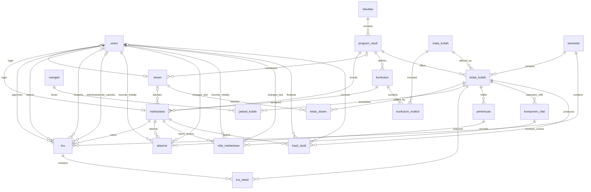

# Kampusia database design

This document is the source of truth for the database design. Twenty PostgreSQL tables are implemented in `packages/db/schema/`: the initial 15 tables from `packages/db/migrations/0000_initial.sql`, followed by the `pertemuan` and `absensi` extension and the `komponen_nilai`, `nilai_mahasiswa`, and `hasil_studi` extension. The initial migration was applied and verified on the local Podman development database on 2026-09-05, the attendance extension on 2026-09-14, and the grading extension on 2026-09-15. Migration state is specific to each database.

The academic/staff identity-number authentication redesign in this document is the approved target design but is not implemented yet. In particular, the current Drizzle schema, migrations, API, frontend, and development seed still use email login and do not yet contain `users.login_id` or `dosen.nik`. The target table definitions and migration plan below intentionally precede implementation; a later implementation must update every affected layer together.

The grading tables are implemented only at the database layer; their application APIs, service policies, and frontend remain future work. This document must be updated before any later design change and implemented schema must be checked against it. See [database package notes](../packages/db/README.md) for verification commands and the boundary between database constraints and service rules.

## Shared conventions

- All table, column, constraint, and index names use snake_case.
- Every table, including junction tables, has an `id uuid PRIMARY KEY DEFAULT gen_random_uuid()`.
- Every table has non-null `created_at timestamptz DEFAULT now()` and `updated_at timestamptz DEFAULT now()`. The service updates `updated_at` on every mutation; its default alone does not update existing rows.
- Column tables below include these shared columns. “No” in Nullable means `NOT NULL`. A dash in Default means no database default; a required value must be supplied.
- Foreign keys reference the target table's `id` unless a composite reference is explicitly documented, with `ON DELETE RESTRICT ON UPDATE RESTRICT` in either case. No cascading deletion is planned. Retain academic history; deactivate or cancel referenced records instead of deleting them.
- Primary keys and unique constraints provide their own indexes. Additional indexes listed below are B-tree unless specified. Do not add duplicate indexes on the same keys. Composite indexes also serve lookups on their leading column.
- Nullable unique columns allow multiple nulls; any supplied non-null value must be unique.
- Business codes and identifiers are text, preserving leading zeros. Trim input; normalize ordinary codes to uppercase and email to lowercase before persistence. `users.login_id`, `mahasiswa.nim`, and `dosen.nik` use their more specific digits-only rules below: trim surrounding whitespace, validate ASCII digits, and store the resulting string without numeric parsing or zero removal. Require nonblank values for required text fields, and reject blank optional text in favor of null. Database checks must enforce canonical storage for unique codes, identifiers, and email.
- Status, role, jenjang, and jenis columns use the documented PostgreSQL varchar type with a CHECK limiting values to the listed set. These are initial product choices, not statutory requirements.
- Local weekly schedule times use the campus timezone, initially Asia/Jakarta. Instants such as submission timestamps use timestamptz.
- Database constraints enforce row-local validity, uniqueness, and references, including the documented composite foreign key enforcing student/curriculum program compatibility. Services enforce remaining cross-table rules and authorization inside transactions; single-column foreign keys alone do not enforce semester, program, curriculum, or role compatibility.
- Paginate list queries. Initial indexes support identifiers and common relationships; add name-search indexes only after defining and measuring the actual search pattern.

## Relationship overview



Each student's faculty is derived through program_studi. A student's current academic adviser is the optional dosen referenced by mahasiswa.dosen_pa_id; this current assignment is distinct from the actor snapshots retained on KRS decisions. Course membership and recommended semester belong in kurikulum_matkul. Students select semester-specific offerings through krs and krs_detail. Lecturer assignments use kelas_dosen, including team teaching. Actual class meetings belong to kelas_kuliah, and attendance joins each meeting directly to a student. Semester, course, program, and class are derived through the meeting's class rather than copied into attendance.

The optional users-to-profile relationships use UUID foreign keys, while login identity ownership follows business identifiers: `mahasiswa.nim` owns a linked MAHASISWA `users.login_id`, `dosen.nik` owns a linked DOSEN `users.login_id`, and ADMIN/AKADEMIK own their staff NIK directly in `users.login_id`. Equality and role compatibility are transactional service invariants rather than implied by the diagram or enforced by a row-local CHECK.

Grading configuration belongs to a class offering through komponen_nilai, and each component has student scores through nilai_mahasiswa. Before finalization, an effective approved enrollment is the eligibility source. Finalization writes one hasil_studi snapshot for each eligible student and class. After that point, hasil_studi—not the mutable current KRS status—is the authoritative historical course result from which KHS, IPS, and IPK are derived.

## Table definitions

### users

Authentication accounts, separate from student and lecturer academic profiles. This definition describes the target identity-number design; see the staged migration section below for the temporary nullable transition.

| Column | PostgreSQL type | Nullable | Default | Meaning / reference |
| --- | --- | --- | --- | --- |
| `id` | `uuid` | No | gen_random_uuid() | Primary key |
| `login_id` | `varchar(30)` | No | — | Globally unique, human-entered academic/staff login identifier; digits only |
| `email` | `varchar(254)` | Yes | — | Optional canonical lowercase contact/recovery email; not a normal login identifier |
| `password_hash` | `text` | No | — | Secure password hash; never plaintext |
| `role` | `varchar(16)` | No | — | ADMIN, AKADEMIK, DOSEN, or MAHASISWA |
| `is_active` | `boolean` | No | true | Whether login is permitted |
| `created_at` | `timestamptz` | No | now() | Creation instant |
| `updated_at` | `timestamptz` | No | now() | Last mutation instant |

**Primary key:** `id`.

**Foreign keys:** None.

**Unique constraints:** `UNIQUE (login_id)` and `UNIQUE (email)`. PostgreSQL permits multiple null email values while rejecting duplicate supplied emails. During the staged migration, the same login ID uniqueness constraint permits multiple temporary nulls; the target schema makes `login_id` NOT NULL only after provisioning is complete.

**Additional indexes:** None beyond primary/unique indexes.

**Business rules:**

- CHECK `login_id ~ '^[0-9]+$'`. `varchar(30)` matches the existing identifier capacity and is a storage maximum, not an institution-specific fixed-length policy. The service trims surrounding whitespace and then validates one through 30 ASCII digits. It never parses the value as `Number`, `bigint`, or a PostgreSQL arithmetic type, so leading zeroes are significant and retained.
- CHECK `email IS NULL OR (btrim(email) <> '' AND email = lower(email) AND email = btrim(email))`. A blank submitted email is normalized to null. Email remains unique when present and retained as optional contact or possible future recovery data, but no password-recovery flow is introduced by this design.
- `login_id` is globally unique across all roles. A student NIM and staff NIK therefore cannot coexist as login identifiers when their strings are equal, even though they originate in different profile domains. Services should preflight this condition for a useful error; the database unique constraint is the final concurrency-safe guard.
- An account has one role in the initial design. ADMIN and AKADEMIK accounts need no academic profile.
- A linked mahasiswa account must have role MAHASISWA and `users.login_id = mahasiswa.nim`; a linked dosen account must have role DOSEN and `users.login_id = dosen.nik`. Services prevent incompatible links, mismatched identifiers, and incompatible role changes.
- An account may be linked to at most one student or one lecturer, never both. The per-table unique constraints do not enforce the cross-table exclusion; account linking must lock the users row and validate it.
- For ADMIN and AKADEMIK, `users.login_id` directly owns the internal campus staff NIK. No `pegawai` table is added merely for authentication. A future personnel module may normalize that ownership after a separately documented migration.
- Disabling a login does not cancel academic records. Never expose password_hash in API responses.

**CHECK constraints:** digits-only `login_id`; canonical nullable email; nonblank password hash; and the documented role set. The target `login_id` NOT NULL constraint is applied only at the end of the staged migration.

**Relationships:** Optional one-to-one links from mahasiswa and dosen; one-to-many latest KRS approval, rejection, reopening, and administrative-cancellation actor references; one-to-many initial and latest attendance-recording references.

**Retention/history behavior:** Keep `login_id`, email, password hash, role, and actor references when an account is deactivated. Do not erase historical email during migration merely because it stops being the login identifier. Clearing an optional email is an explicit authorized account update, not a side effect of login migration or profile changes.

### fakultas

Faculty master data.

| Column | PostgreSQL type | Nullable | Default | Meaning / reference |
| --- | --- | --- | --- | --- |
| `id` | `uuid` | No | gen_random_uuid() | Primary key |
| `kode` | `varchar(20)` | No | — | Institution-wide faculty code |
| `nama` | `varchar(150)` | No | — | Faculty name |
| `is_active` | `boolean` | No | true | Available for new academic setup |
| `created_at` | `timestamptz` | No | now() | Creation instant |
| `updated_at` | `timestamptz` | No | now() | Last mutation instant |

**Primary key:** `id`.

**Foreign keys:** None.

**Unique constraints:** `UNIQUE (kode)`.

**Additional indexes:** None beyond primary/unique indexes.

**Business rules:**

- Deactivation retains programs and academic history. Services must reject new active program assignments to an inactive faculty.

**Relationships:** One faculty has many program_studi.

### program_studi

Study programs within faculties.

| Column | PostgreSQL type | Nullable | Default | Meaning / reference |
| --- | --- | --- | --- | --- |
| `id` | `uuid` | No | gen_random_uuid() | Primary key |
| `fakultas_id` | `uuid` | No | — | FK fakultas.id |
| `kode` | `varchar(20)` | No | — | Institution-wide study program code |
| `nama` | `varchar(150)` | No | — | Study program name |
| `jenjang` | `varchar(12)` | No | — | D1, D2, D3, D4, S1, S2, S3, or PROFESI |
| `is_active` | `boolean` | No | true | Available for new assignments |
| `created_at` | `timestamptz` | No | now() | Creation instant |
| `updated_at` | `timestamptz` | No | now() | Last mutation instant |

**Primary key:** `id`.

**Foreign keys:** `fakultas_id` → fakultas.id.

**Unique constraints:** `UNIQUE (kode)`.

**Additional indexes:** `(fakultas_id)`.

**Business rules:**

- Every program belongs to exactly one faculty. Do not duplicate fakultas_id in mahasiswa.
- Inactive programs retain students, curricula, lecturers, and historical offerings; reject new assignments to them.
- Changing faculty is an administrative correction and must not silently change the intended historical meaning of existing data.

**Relationships:** Many programs belong to one faculty; a program has many students, curricula, offerings, and optional lecturer homebases.

### mahasiswa

Student academic identity and assigned curriculum.

| Column | PostgreSQL type | Nullable | Default | Meaning / reference |
| --- | --- | --- | --- | --- |
| `id` | `uuid` | No | gen_random_uuid() | Primary key |
| `user_id` | `uuid` | Yes | — | FK users.id |
| `program_studi_id` | `uuid` | No | — | FK program_studi.id |
| `kurikulum_id` | `uuid` | No | — | Part of composite FK (kurikulum_id, program_studi_id) to kurikulum (id, program_studi_id) |
| `dosen_pa_id` | `uuid` | Yes | — | FK dosen.id; current academic adviser |
| `nim` | `varchar(30)` | No | — | Digits-only student academic identifier and login identity source of truth |
| `nama` | `varchar(150)` | No | — | Student full name |
| `angkatan` | `smallint` | No | — | Entry year |
| `status` | `varchar(16)` | No | AKTIF | AKTIF, CUTI, LULUS, KELUAR, or NONAKTIF |
| `created_at` | `timestamptz` | No | now() | Creation instant |
| `updated_at` | `timestamptz` | No | now() | Last mutation instant |

**Primary key:** `id`.

**Foreign keys:** `user_id` → users.id; `program_studi_id` → program_studi.id; `dosen_pa_id` → dosen.id; `FOREIGN KEY (kurikulum_id, program_studi_id) REFERENCES kurikulum (id, program_studi_id) ON DELETE RESTRICT ON UPDATE RESTRICT`. Every foreign key uses `ON DELETE RESTRICT ON UPDATE RESTRICT`. The composite reference replaces the single-column kurikulum_id foreign key; both participating columns are NOT NULL.

**Unique constraints:** `UNIQUE (nim)` and `UNIQUE (user_id)`. NIM is not a primary key.

**Additional indexes:** `(program_studi_id, angkatan)`, `(kurikulum_id)`, and `(dosen_pa_id)`. The adviser index supports scoped advisee and submitted-KRS lists; null rows remain valid while an adviser has not been assigned.

**Business rules:**

- CHECK `nim ~ '^[0-9]+$'`. NIM is a one-through-30-digit identifier string, not a numeric quantity; preserve leading zeroes. This replaces the current general uppercase-code semantics when the identity redesign is implemented.
- CHECK angkatan BETWEEN 1900 AND 9999.
- An academic record may exist before a login account is provisioned.
- When `user_id` is present, the linked account must have role MAHASISWA and `users.login_id` must exactly equal `mahasiswa.nim`. The foreign key and the two single-column unique constraints cannot enforce this cross-table role/equality rule; the profile/account service must enforce it in the same transaction used to create or change the link.
- `mahasiswa.nim` owns student academic identity. Creating a linked account copies the canonical NIM into `users.login_id`; it does not create another student login-number field. Changing a linked student's NIM must atomically update both columns after authorization and uniqueness checks. It must never silently unlink the account or allow a committed mismatch.
- Assigned curriculum must belong to the student's program. PostgreSQL enforces this on inserts and updates through the composite foreign key to kurikulum; service validation may provide a clearer error but is not the integrity guarantee. The referenced curriculum's program cannot change while student references would become invalid. Only AKTIF students may submit or obtain approval for new KRS.
- `dosen_pa_id` is nullable because imported, newly created, graduated, or otherwise inactive records may temporarily have no current adviser. Assigning or changing it requires an authorized ADMIN/AKADEMIK action and an active dosen. A student must have a current active Dosen PA with an active linked DOSEN account before submitting a KRS, so a submitted plan cannot be left without a normal reviewer.
- Dosen homebase does not by itself limit adviser assignment; a cross-program restriction would be an additional institutional policy. Changing `dosen_pa_id` immediately transfers access to pending/current advisee work: the new current adviser gains access and the old adviser loses it. It never rewrites `disetujui_oleh`, `ditolak_oleh`, `dibuka_kembali_oleh`, or other historical KRS actor snapshots.
- Program or curriculum reassignment requires explicit academic review; do not reinterpret approved KRS history. The initial design does not model transfer history.

**Relationships:** Belongs to one program and one curriculum, optionally one user and one current Dosen PA; has many KRS, one per semester, and many attendance rows across meetings. One dosen may advise many students.

**Retention/history behavior:** A NIM correction changes the current identifier only; UUID foreign keys keep academic history attached to the same student. The old NIM immediately stops working as a login and is not retained as an alias in this milestone. If regulations require identifier-change history, introduce a separately reviewed audit/history design before claiming that history exists.

### dosen

Lecturer identity, independent of class assignments.

| Column | PostgreSQL type | Nullable | Default | Meaning / reference |
| --- | --- | --- | --- | --- |
| `id` | `uuid` | No | gen_random_uuid() | Primary key |
| `user_id` | `uuid` | Yes | — | FK users.id |
| `program_studi_id` | `uuid` | Yes | — | FK program_studi.id |
| `nik` | `varchar(30)` | Yes | — | Internal campus employee/staff number used for DOSEN login; digits only when present |
| `kode_dosen` | `varchar(30)` | No | — | Institution-issued lecturer identifier |
| `nidn` | `varchar(30)` | Yes | — | National lecturer identifier when available |
| `nama` | `varchar(150)` | No | — | Lecturer full name |
| `is_active` | `boolean` | No | true | Available for new teaching assignments |
| `created_at` | `timestamptz` | No | now() | Creation instant |
| `updated_at` | `timestamptz` | No | now() | Last mutation instant |

**Primary key:** `id`.

**Foreign keys:** `user_id` → users.id; `program_studi_id` → program_studi.id.

**Unique constraints:** `UNIQUE (nik)`, `UNIQUE (kode_dosen)`, `UNIQUE (nidn)`, and `UNIQUE (user_id)`. Nullable uniqueness permits multiple lecturers without NIK/NIDN while rejecting duplicate supplied values. Lecturer identifiers are not primary keys.

**Additional indexes:** `(program_studi_id)`.

**Business rules:**

- CHECK `nik IS NULL OR nik ~ '^[0-9]+$'`. `varchar(30)` is a maximum compatible with other identity fields, not a fixed institutional length. A supplied NIK is trimmed, must contain one through 30 ASCII digits, remains a string, and preserves leading zeroes.
- `nik` is the internal employee/staff identifier used for lecturer login. It is distinct from `kode_dosen` and from the optional national lecturer identifier `nidn`; neither existing field is reinterpreted or copied automatically into NIK.
- NIK remains nullable for imported, historical, visiting, or profile-only lecturers that have no Kampusia login. If `user_id` is present, NIK is required, the linked account must have role DOSEN, and `users.login_id` must exactly equal `dosen.nik`. These cross-table conditions are service-enforced in the linking transaction.
- `dosen.nik` owns the employee login identity for DOSEN. Changing a linked lecturer's NIK must atomically update `users.login_id` after authorization and uniqueness checks; it must not unlink the account. Clearing NIK is rejected while an account remains linked.
- kode_dosen identifies every lecturer locally; nidn is optional to accommodate lecturers without that identifier. Each supplied identifier is unique in its own column.
- Homebase is optional and does not restrict teaching in other programs.
- Inactive lecturers retain historical assignments and cannot receive new assignments.

**Relationships:** Optional user and homebase program; many-to-many with kelas_kuliah through kelas_dosen; one-to-many current academic-adviser assignments through mahasiswa.dosen_pa_id.

**Retention/history behavior:** Inactivation does not clear NIK, account linkage, or historical assignments. A NIK correction replaces the current identifier; the prior value is not a login alias or revision log. A future employee/personnel or identity-history module is outside this milestone.

### Academic/staff login identity design (cross-table)

#### Identity ownership and invariants

"NIK" in Kampusia means an internal campus employee/staff identification number. It never means the Indonesian national KTP NIK, and national identity data is not introduced by this design.

| Role | Current identity source of truth | Linked-account invariant |
| --- | --- | --- |
| MAHASISWA | `mahasiswa.nim` | `users.role = 'MAHASISWA'` and `users.login_id = mahasiswa.nim` |
| DOSEN | `dosen.nik` | NIK is non-null, `users.role = 'DOSEN'`, and `users.login_id = dosen.nik` |
| AKADEMIK | `users.login_id` | The value is the staff member's internal campus NIK |
| ADMIN | `users.login_id` | The value is the staff member's internal campus NIK |

There is one global login namespace because `users.login_id` is unique across every role. A student NIM that equals an ADMIN, AKADEMIK, or DOSEN NIK is a collision and one of the identifiers must be corrected by an authorized operator; role does not disambiguate login.

PostgreSQL enforces row-local digits-only storage, maximum length, nullability, profile-level uniqueness, global account-level uniqueness, and UUID foreign keys. It does not use triggers or a duplicated foreign key to enforce the equality and role conditions above. A row-local CHECK cannot inspect another table, and ordinary foreign keys would not express role compatibility or the optional one-account/one-profile rules cleanly. Transactional service validation therefore remains required even though unique constraints are the final guard against concurrent identifier collisions.

Provisioning or linking a profile account must:

1. Require an authorized ADMIN or AKADEMIK actor; students and lecturers cannot link themselves or change their own login identity through profile forms.
2. Normalize and validate the profile identifier as a string of ASCII digits without converting it to a numeric type.
3. Lock and validate the profile and users rows using one consistent account-linking lock order.
4. Confirm the required role, confirm that the account is not linked to either another profile of the same kind or the other profile table, and confirm the applicable NIM/NIK is available in the global login namespace.
5. Set the profile `user_id` and matching `users.login_id` in one transaction. Any failed validation or unique constraint rolls back the entire operation.

The account-management UI must not ask an operator to type or compare a raw `users.id` UUID. Search/select controls may submit a UUID internally as the stable foreign key, but visible results use identity and name, for example `20260001 · Andi Saputra` for MAHASISWA and `00123456 · Rina Pratama` for DOSEN. Email is secondary contact text, not the primary account label.

Ordinary profile editing must not silently unlink an account. If explicit unlinking remains available in the later implementation, it is a separate authorized operation and must either deactivate the account or relink it as part of the same transaction; it must not leave an active MAHASISWA/DOSEN account appearing usable while it has no corresponding profile. Removing a link does not erase credentials, email, or identity history implicitly.

#### Login API, UI, and authorization boundary

The future shared request remains `POST /auth/login` but changes its request body to:

```json
{
  "login_id": "20260001",
  "password": "..."
}
```

The authentication service trims `login_id`, validates one through 30 ASCII digits, uses the normalized string as the rate-limit key, loads `users` by `login_id`, checks `users.is_active`, verifies the existing password hash, and creates the existing opaque-cookie session. Unknown identifiers, wrong passwords, and inactive accounts continue to use one generic credential error so account existence is not disclosed. Safe user responses and account displays use the login identifier rather than treating email as identity.

The web application keeps one `/login` page for every role, with **Nomor Induk**, **Password**, and **Masuk** controls. It must use a text input with an appropriate numeric input mode—not an HTML numeric value—so leading zeroes survive. The authenticated account's role determines the existing post-login destination. Separate Mahasiswa, Dosen, and administrator authentication systems are not introduced.

Email is not accepted by the normal login endpoint after cutover. The project has only development fixture accounts and no demonstrated compatibility requirement that justifies ambiguous dual lookup, so there is no email fallback period. Existing email values are preserved as nullable, unique contact/recovery data. Password recovery by email is not designed in this milestone.

This redesign does not change password hashing, session token generation/storage, cookie flags, logout, absolute session expiry, origin/CSRF checks, role semantics, or server-side authorization. The opaque token remains in the existing HttpOnly cookie and is never moved to localStorage. `users.is_active` remains the authentication status. Academic state remains independent: for example, `mahasiswa.status = 'CUTI'` does not imply `users.is_active = false`, and deactivating an account does not rewrite academic status or history.

#### Identifier changes

Changing `mahasiswa.nim` or `dosen.nik` on a linked profile is an identity/account operation, not a simple isolated profile update. Only ADMIN or AKADEMIK may perform it. The service must use one transaction to:

1. lock the profile and linked users row according to the common linking lock order;
2. recheck actor authorization, the link, account role, and current identifier equality;
3. normalize the proposed digits-only value and preflight both profile and global login uniqueness;
4. update the source profile identifier and `users.login_id`, including both `updated_at` values; and
5. commit both changes together, or roll back both when either unique constraint or any validation fails.

The database constraints still matter after application preflight because two concurrent changes can select the same free value. `UNIQUE (mahasiswa.nim)`, `UNIQUE (dosen.nik)`, and global `UNIQUE (users.login_id)` arbitrate that race. Constraint errors must become a clear domain conflict rather than leaking raw PostgreSQL details.

UUID primary/foreign keys mean an authorized correction does not detach KRS, attendance, grading, teaching, or actor history from its person/account. The new identifier takes effect for the next login immediately; existing opaque sessions keep their current expiry and authorization behavior because session architecture is unchanged. This milestone stores only the current NIM/NIK, so an old identifier is neither a login alias nor a complete change history.

#### Staged migration and backfill

The safer migration is staged provisioning, not failure-prone inference. It temporarily permits `users.login_id` to be null for an unmapped legacy account, and authentication by identifier refuses such an account until an authorized mapping is supplied. This can cause an explicit, reported temporary lockout, but it is safer than inventing a staff NIK or silently deriving one from email, lecturer code, NIDN, UUID, or row order.

A later implementation should use this sequence:

1. Inventory every users row, profile link, duplicate/collision candidate, non-digit NIM, and existing email. Produce an explicit mapping list for every ADMIN, AKADEMIK, and linked DOSEN account before cutover.
2. Add nullable `users.login_id varchar(30)` with its unique constraint and nullable digits-only CHECK. Add nullable `dosen.nik varchar(30)` with its unique constraint and nullable digits-only CHECK. Keep the existing UUID relationships. Do not add a `pegawai` table.
3. Normalize/validate `mahasiswa.nim` under the new digits-only policy. Known development fixtures receive the deterministic replacements below. Non-fixture alphanumeric NIMs require an institution-approved NIM correction; they are not stripped, hashed, or otherwise guessed.
4. For each linked MAHASISWA whose canonical NIM is valid and whose user role is MAHASISWA, backfill `users.login_id` directly from `mahasiswa.nim`. A mismatch in role or competing global value blocks that row for review.
5. Populate `dosen.nik` only from an explicit trusted mapping. For each linked DOSEN, require a mapped numeric NIK and matching DOSEN role, then set `dosen.nik` and `users.login_id` together. Never reinterpret `kode_dosen` or `nidn` as NIK.
6. Populate ADMIN and AKADEMIK `users.login_id` only from explicit internal-staff mappings. Never derive staff NIK from email. Leave genuinely unmapped legacy accounts null, inactive or operationally blocked, and report them for provisioning.
7. Deploy the API/frontend cutover so login queries only `login_id`; do not retain email authentication as a fallback. Make `users.email` nullable while preserving every existing non-null value. New blank emails normalize to null, and supplied emails remain canonical and unique.
8. Audit that every non-null linked profile satisfies its role/equality invariant and that every active user has a login ID. Once all retained accounts are provisioned, set `users.login_id` NOT NULL. If unmapped records must be retained longer, keep this final constraint as an explicitly tracked follow-up rather than fabricate values; the target schema is still NOT NULL.

The data/schema changes, application cutover, and final NOT NULL enforcement must be coordinated in a maintenance/release plan so an old email-only application is not run against a target schema that permits null email. No row, email, password hash, account, or academic record is deleted by this migration. Rollback planning must preserve the explicit mapping artifact and must not re-enable ambiguous dual-identifier login silently.

#### Development seed design

The future development fixture uses deterministic, numeric, visibly reserved demo values:

| Role/profile | Proposed demo `login_id` | Source/profile value |
| --- | --- | --- |
| ADMIN | `99000001` | Direct staff fixture NIK in `users.login_id` |
| AKADEMIK | `99000002` | Direct staff fixture NIK in `users.login_id` |
| DOSEN | `99000003` | Rina Pratama (Demo) has `dosen.nik = '99000003'` |
| MAHASISWA | `99202601` | Andi Saputra (Demo) has `mahasiswa.nim = '99202601'` |

The remaining demo students use `99202602` through `99202605` so the complete fixture satisfies the digits-only NIM policy. These values are development-only fixture choices, not institutional length, allocation, or reserved-prefix policy. Existing demo emails may remain as optional contact data but are not credentials.

The seed continues to take the password from `SEED_PASSWORD`; neither schema nor migration contains plaintext credentials. A safe fixture upgrade recognizes the existing fixed fixture UUIDs, changes their legacy `DEV2026...` NIM values only through an explicit one-time known-fixture path, and aligns the linked account values transactionally. It must not apply that transformation to arbitrary non-fixture rows. Reruns remain development-only, conflict-safe, and idempotent, and they preserve stored password hashes rather than rehashing or resetting existing accounts.

#### Future verification plan

Database tests must prove:

- `users.login_id` is globally unique, accepts/preserves leading zeroes as text, and rejects blank, alphabetic, signed, decimal, or whitespace-containing values;
- `dosen.nik` is nullable for an unlinked/profile-only lecturer, unique when present, digits-only, and preserves leading zeroes;
- `mahasiswa.nim` remains unique and obeys the digits-only policy; and
- multiple null emails are allowed, duplicate supplied emails are rejected, and supplied email canonicalization is enforced.

Authentication tests must cover successful login with a student NIM, DOSEN NIK, AKADEMIK NIK, and ADMIN NIK; wrong password; inactive account; unknown Nomor Induk; leading-zero identifiers; and rejection of email at the login endpoint. Existing cookie, logout, expiry, origin, role, and session-revocation tests remain applicable.

Synchronization tests must cover linked MAHASISWA and DOSEN equality/role rules, incompatible and cross-profile links, atomic NIM/NIK changes, global student/staff collisions, concurrent uniqueness races, clear conflict messages, and rollback that leaves both profile and users values unchanged. Selector tests must verify human-readable identity/name labels and no exposed raw-UUID input workflow.

Seed tests must verify all four demo roles authenticate by the numeric values above, the linked DOSEN NIK and student NIM equal their account login IDs, every fixture NIM/NIK is digits-only, reruns are idempotent, and existing password hashes remain byte-for-byte stable.

#### Decisions deferred beyond this redesign

- Institution-assigned production NIM/NIK values and any exact length rules must be supplied by institutional policy; this design deliberately sets only a 30-character storage maximum.
- Whether verified email will later support password recovery remains open. Email is merely nullable contact/recovery-capable data here.
- A complete NIM/NIK change ledger and old-identifier aliases are not implemented. Old identifiers stop authenticating immediately after an atomic correction.
- A normalized employee/personnel model may later own ADMIN, AKADEMIK, and DOSEN identity, but no `pegawai` table is justified in this milestone.
- SSO, OAuth, LDAP, MFA, username aliases, multiple login identifiers, and national KTP NIK remain outside scope.

### semester

Explicit academic terms and the globally selected active term.

| Column | PostgreSQL type | Nullable | Default | Meaning / reference |
| --- | --- | --- | --- | --- |
| `id` | `uuid` | No | gen_random_uuid() | Primary key |
| `kode` | `varchar(5)` | No | — | YYYY1 for Ganjil or YYYY2 for Genap |
| `nama` | `varchar(100)` | No | — | Display name, e.g. Ganjil 2026/2027 |
| `tahun_mulai` | `smallint` | No | — | First year of academic year |
| `jenis` | `varchar(8)` | No | — | GANJIL or GENAP |
| `tanggal_mulai` | `date` | No | — | Term start date |
| `tanggal_selesai` | `date` | No | — | Term end date |
| `krs_mulai_at` | `timestamptz` | Yes | — | Inclusive opening instant for the ordinary KRS workflow |
| `krs_selesai_at` | `timestamptz` | Yes | — | Exclusive closing instant for the ordinary KRS workflow |
| `is_active` | `boolean` | No | false | Explicit active-term selection |
| `created_at` | `timestamptz` | No | now() | Creation instant |
| `updated_at` | `timestamptz` | No | now() | Last mutation instant |

**Primary key:** `id`.

**Foreign keys:** None.

**Unique constraints:** `UNIQUE (kode)` and `UNIQUE (tahun_mulai, jenis)`; unique partial index `(is_active) WHERE is_active = true` permits at most one active term.

**Additional indexes:** None beyond primary/unique indexes.

**Business rules:**

- CHECK tahun_mulai BETWEEN 1900 AND 9998 and tanggal_mulai <= tanggal_selesai.
- CHECK kode matches tahun_mulai followed by 1 for GANJIL or 2 for GENAP. The initial model has two regular terms per academic year.
- CHECK `krs_mulai_at` and `krs_selesai_at` are either both null or both non-null, and when present `krs_mulai_at < krs_selesai_at`. Null/null means the KRS period has not been configured and is closed; one-sided/open-ended periods are not valid.
- The KRS window is the half-open interval `[krs_mulai_at, krs_selesai_at)`, compared against the database/server current instant. `timestamptz` represents instants; the UI renders them in the configured campus timezone. This boundary avoids two periods both accepting a mutation at the same closing/opening instant.
- Academic dates and KRS timestamps do not determine is_active. Switch the active term in one transaction. Zero active terms are allowed during setup. `is_active` means “currently selected academic term”; the KRS interval independently means “ordinary KRS workflow is open.” Student mutations and normal Dosen PA decisions require both conditions.
- Do not alter term identity or dates once doing so would invalidate approved enrollments, schedules, or actual meetings. A meeting date must remain within its owning term.
- Changing a KRS interval is an explicit ADMIN/AKADEMIK configuration action. It affects whether future actions are permitted but never recalculates `batas_sks`, changes existing KRS statuses/details, or rewrites submission, review, attendance, grading, KHS, IPS, or IPK history.

**Relationships:** One semester has many offerings and KRS.

### mata_kuliah

Reusable course catalog records.

| Column | PostgreSQL type | Nullable | Default | Meaning / reference |
| --- | --- | --- | --- | --- |
| `id` | `uuid` | No | gen_random_uuid() | Primary key |
| `kode` | `varchar(30)` | No | — | Institution-wide course code |
| `nama` | `varchar(150)` | No | — | Course name |
| `sks` | `smallint` | No | — | Course credit value |
| `is_active` | `boolean` | No | true | Available for new offerings and curriculum membership |
| `created_at` | `timestamptz` | No | now() | Creation instant |
| `updated_at` | `timestamptz` | No | now() | Last mutation instant |

**Primary key:** `id`.

**Foreign keys:** None.

**Unique constraints:** `UNIQUE (kode)`.

**Additional indexes:** None beyond primary/unique indexes.

**Business rules:**

- CHECK sks > 0.
- Do not store recommended semester or kurikulum_id here. One course can belong to multiple curricula through kurikulum_matkul.
- Treat sks and academic identity as immutable once used by an offering or assigned curriculum. A change in credit value requires a new catalog version with a distinct code, preserving historical credit calculations.

**Relationships:** Many curriculum memberships and semester-specific offerings.

### kurikulum

A version of a study program's curriculum.

| Column | PostgreSQL type | Nullable | Default | Meaning / reference |
| --- | --- | --- | --- | --- |
| `id` | `uuid` | No | gen_random_uuid() | Primary key |
| `program_studi_id` | `uuid` | No | — | FK program_studi.id |
| `kode` | `varchar(30)` | No | — | Curriculum code within program |
| `nama` | `varchar(150)` | No | — | Curriculum name |
| `tahun_berlaku` | `smallint` | No | — | Starting curriculum year |
| `is_active` | `boolean` | No | true | Available for new student assignment |
| `created_at` | `timestamptz` | No | now() | Creation instant |
| `updated_at` | `timestamptz` | No | now() | Last mutation instant |

**Primary key:** `id`.

**Foreign keys:** `program_studi_id` → program_studi.id.

**Unique constraints:** `UNIQUE (program_studi_id, kode)` and `UNIQUE (id, program_studi_id)`. The latter supplies the composite unique key referenced by mahasiswa, even though id remains the UUID primary key.

**Additional indexes:** None beyond primary/unique indexes; the unique index on (program_studi_id, kode) covers program_studi_id, and UNIQUE (id, program_studi_id) supplies its own index for the composite reference.

**Business rules:**

- CHECK tahun_berlaku BETWEEN 1900 AND 9999.
- Multiple curriculum versions may remain active for different cohorts. Deactivation prevents new assignments but does not invalidate existing students.
- Once assigned to students, preserve membership and academic requirements; create a new curriculum version for substantive changes.

**Relationships:** Belongs to one program; has many assigned students and kurikulum_matkul entries.

### kurikulum_matkul

Course membership and placement within a curriculum.

| Column | PostgreSQL type | Nullable | Default | Meaning / reference |
| --- | --- | --- | --- | --- |
| `id` | `uuid` | No | gen_random_uuid() | Primary key |
| `kurikulum_id` | `uuid` | No | — | FK kurikulum.id |
| `mata_kuliah_id` | `uuid` | No | — | FK mata_kuliah.id |
| `semester_rekomendasi` | `smallint` | Yes | — | Recommended study semester; null means unspecified |
| `is_wajib` | `boolean` | No | true | Required course rather than elective |
| `created_at` | `timestamptz` | No | now() | Creation instant |
| `updated_at` | `timestamptz` | No | now() | Last mutation instant |

**Primary key:** `id`.

**Foreign keys:** `kurikulum_id` → kurikulum.id; `mata_kuliah_id` → mata_kuliah.id.

**Unique constraints:** `UNIQUE (kurikulum_id, mata_kuliah_id)`.

**Additional indexes:** `(mata_kuliah_id)`; the unique index covers kurikulum_id.

**Business rules:**

- CHECK semester_rekomendasi IS NULL OR semester_rekomendasi > 0.
- A recommendation is not an eligibility prohibition. Elective and required membership both use this junction.
- Do not duplicate course name or SKS here. Refer to the catalog; preserve assigned curriculum versions.

**Relationships:** Joins kurikulum and mata_kuliah in a many-to-many relationship.

### kelas_kuliah

A course offering by a program in a particular academic semester.

| Column | PostgreSQL type | Nullable | Default | Meaning / reference |
| --- | --- | --- | --- | --- |
| `id` | `uuid` | No | gen_random_uuid() | Primary key |
| `semester_id` | `uuid` | No | — | FK semester.id |
| `mata_kuliah_id` | `uuid` | No | — | FK mata_kuliah.id |
| `program_studi_id` | `uuid` | No | — | FK program_studi.id |
| `nama_kelas` | `varchar(20)` | No | — | Class label, e.g. A |
| `kapasitas` | `integer` | No | — | Maximum approved active enrollments |
| `status` | `varchar(16)` | No | DRAFT | DRAFT, DIBUKA, DITUTUP, or DIBATALKAN |
| `created_at` | `timestamptz` | No | now() | Creation instant |
| `updated_at` | `timestamptz` | No | now() | Last mutation instant |

**Primary key:** `id`.

**Foreign keys:** `semester_id` → semester.id; `mata_kuliah_id` → mata_kuliah.id; `program_studi_id` → program_studi.id.

**Unique constraints:** `UNIQUE (semester_id, program_studi_id, mata_kuliah_id, nama_kelas)`.

**Additional indexes:** `(mata_kuliah_id)`, `(program_studi_id)`, and `(semester_id, status)`.

**Business rules:**

- CHECK kapasitas > 0. Never store jumlah_mahasiswa; derive enrollment counts as defined below.
- Before DIBUKA, require an active program/course, at least one active lecturer assignment, and at least one valid conflict-free schedule.
- Before DIBUKA, the service must also verify that the class's mata_kuliah belongs to at least one curriculum for its offering program_studi: a kurikulum_matkul row must match kelas_kuliah.mata_kuliah_id and join to a kurikulum whose program_studi_id equals kelas_kuliah.program_studi_id. This is required for opening a class in the initial system.
- DIBUKA accepts selections and approvals. DITUTUP prevents new enrollment while existing enrollments remain valid. DIBATALKAN requires transactional cancellation of related active details and any remaining TERJADWAL meetings; completed meetings and attendance remain historical.
- Do not change semester, course, or offering program after selections exist. Capacity reductions must not fall below approved active enrollment count.
- Initial enrollment is limited to the student's program and curriculum membership; cross-program enrollment requires a documented design extension.
- Grading can be finalized only while the class is DITUTUP. Once hasil_studi exists, the class cannot be changed to DIBATALKAN through the ordinary workflow and its grading configuration is frozen as documented below.

**Relationships:** Belongs to a semester, course, and program; has many schedules, lecturer assignments, KRS details, meetings, assessment components, and finalized study results.

### kelas_dosen

Lecturer assignments supporting team teaching.

| Column | PostgreSQL type | Nullable | Default | Meaning / reference |
| --- | --- | --- | --- | --- |
| `id` | `uuid` | No | gen_random_uuid() | Primary key |
| `kelas_kuliah_id` | `uuid` | No | — | FK kelas_kuliah.id |
| `dosen_id` | `uuid` | No | — | FK dosen.id |
| `is_koordinator` | `boolean` | No | false | Primary coordinating lecturer |
| `created_at` | `timestamptz` | No | now() | Creation instant |
| `updated_at` | `timestamptz` | No | now() | Last mutation instant |

**Primary key:** `id`.

**Foreign keys:** `kelas_kuliah_id` → kelas_kuliah.id; `dosen_id` → dosen.id.

**Unique constraints:** `UNIQUE (kelas_kuliah_id, dosen_id)`; unique partial index `(kelas_kuliah_id) WHERE is_koordinator = true` allows at most one coordinator.

**Additional indexes:** `(dosen_id)`; unique indexes cover kelas_kuliah_id.

**Business rules:**

- One class may have many lecturers and one lecturer may teach many classes. A coordinator is optional.
- All assigned lecturers are assumed to attend every weekly schedule of the class in this initial model.
- Adding or changing an assignment must revalidate lecturer schedule conflicts. Preserve at least one lecturer on an opened class.

**Relationships:** Joins kelas_kuliah and dosen in a many-to-many relationship.

### ruangan

Teaching rooms used by weekly schedules.

| Column | PostgreSQL type | Nullable | Default | Meaning / reference |
| --- | --- | --- | --- | --- |
| `id` | `uuid` | No | gen_random_uuid() | Primary key |
| `kode` | `varchar(30)` | No | — | Institution-wide room code |
| `nama` | `varchar(100)` | No | — | Room name |
| `gedung` | `varchar(100)` | Yes | — | Building label |
| `kapasitas` | `integer` | No | — | Maximum occupants for a teaching class |
| `is_active` | `boolean` | No | true | Available for new scheduling |
| `created_at` | `timestamptz` | No | now() | Creation instant |
| `updated_at` | `timestamptz` | No | now() | Last mutation instant |

**Primary key:** `id`.

**Foreign keys:** None.

**Unique constraints:** `UNIQUE (kode)`.

**Additional indexes:** None beyond primary/unique indexes.

**Business rules:**

- CHECK kapasitas > 0.
- Every scheduled room must accommodate kelas_kuliah.kapasitas. Reducing room capacity requires checking existing schedules.
- Inactive rooms retain history; deactivation requires resolving current/future schedules before taking effect.

**Relationships:** One room has many schedules at nonconflicting times.

### jadwal_kuliah

Recurring weekly room/time slots for a class over its semester dates.

| Column | PostgreSQL type | Nullable | Default | Meaning / reference |
| --- | --- | --- | --- | --- |
| `id` | `uuid` | No | gen_random_uuid() | Primary key |
| `kelas_kuliah_id` | `uuid` | No | — | FK kelas_kuliah.id |
| `ruangan_id` | `uuid` | No | — | FK ruangan.id |
| `hari` | `smallint` | No | — | 1 = Monday through 7 = Sunday |
| `jam_mulai` | `time without time zone` | No | — | Local start time |
| `jam_selesai` | `time without time zone` | No | — | Local end time |
| `created_at` | `timestamptz` | No | now() | Creation instant |
| `updated_at` | `timestamptz` | No | now() | Last mutation instant |

**Primary key:** `id`.

**Foreign keys:** `kelas_kuliah_id` → kelas_kuliah.id; `ruangan_id` → ruangan.id.

**Unique constraints:** `UNIQUE (kelas_kuliah_id, hari, jam_mulai, jam_selesai)` prevents duplicate class slots.

**Additional indexes:** `(ruangan_id, hari, jam_mulai)`; the unique index covers kelas_kuliah_id.

**Business rules:**

- CHECK hari BETWEEN 1 AND 7 and jam_mulai < jam_selesai. Overnight slots must be split into separate days.
- Services must check room, class, and every assigned lecturer for overlap; uniqueness does not detect partial overlaps.
- Conflict rules apply across semesters with overlapping date ranges, not merely equal semester_id. See concurrency and schedule rules below.
- The initial model requires a physical room; virtual classes and per-date exceptions are outside this design.

**Relationships:** Belongs to one class and one room; lecturers and semester are derived from the class.

### pertemuan

An actual class meeting. It records what occurred or was planned for one date independently of the class's recurring weekly jadwal_kuliah slots.

| Column | PostgreSQL type | Nullable | Default | Meaning / reference |
| --- | --- | --- | --- | --- |
| `id` | `uuid` | No | gen_random_uuid() | Primary key |
| `kelas_kuliah_id` | `uuid` | No | — | FK kelas_kuliah.id |
| `nomor_pertemuan` | `smallint` | No | — | Positive sequence number within the class |
| `tanggal` | `date` | No | — | Actual or planned local meeting date |
| `jam_mulai` | `time without time zone` | No | — | Actual or planned local start time |
| `jam_selesai` | `time without time zone` | No | — | Actual or planned local end time |
| `materi` | `text` | Yes | — | Topic or material; null while not yet specified |
| `status` | `varchar(16)` | No | TERJADWAL | TERJADWAL, SELESAI, or DIBATALKAN |
| `created_at` | `timestamptz` | No | now() | Creation instant |
| `updated_at` | `timestamptz` | No | now() | Last mutation or factual-correction instant |

**Primary key:** `id`.

**Foreign keys:** `kelas_kuliah_id` → kelas_kuliah.id.

**Unique constraints:** `UNIQUE (kelas_kuliah_id, nomor_pertemuan)`, including cancelled meetings. Cancelling a meeting does not release its number for reuse.

**Additional indexes:** `(tanggal, status)` supports date-oriented operational lists; the unique index covers class-scoped meeting lists and lookups.

**CHECK constraints:**

- `nomor_pertemuan > 0`.
- `jam_mulai < jam_selesai`; an overnight meeting must be represented as separate records or by a future documented extension.
- `status IN ('TERJADWAL', 'SELESAI', 'DIBATALKAN')`.
- `materi IS NULL` or contains at least one non-whitespace character.

**Business rules:**

- A meeting belongs to exactly one class. Do not store semester_id, mata_kuliah_id, program_studi_id, or recurring jadwal_kuliah values here; derive them through kelas_kuliah.
- tanggal and times are the actual/planned occurrence and need not equal any recurring jadwal_kuliah weekday or time. A make-up meeting may therefore differ from the weekly schedule, but tanggal must remain within the owning class's semester date range. This cross-table date rule is enforced by the service. The table does not reserve a room or lecturer and does not perform resource-conflict detection; actual-room/resource tracking requires a separately reviewed extension.
- Meetings may normally be created only for DIBUKA or DITUTUP classes. DRAFT classes are not yet teaching, and DIBATALKAN classes cannot receive new meetings.
- TERJADWAL may transition to SELESAI or DIBATALKAN. DIBATALKAN is terminal and remains historical. SELESAI is terminal for normal workflow operations.
- Completing a meeting requires explicit attendance coverage for every student effectively enrolled at finalization time; an empty effective roster is valid. Completion and attendance finalization are one transaction.
- Class cancellation must cancel its remaining TERJADWAL meetings in the same transaction. Existing SELESAI meetings and all attendance remain unchanged.
- Ordinary edits to a SELESAI meeting are prohibited. An explicit authorized factual correction may change tanggal, times, or materi after revalidation, but never kelas_kuliah_id, nomor_pertemuan, or status. The initial model retains the corrected value and mutation timestamp, not every previous value.

**Relationships:** Belongs to one kelas_kuliah and has many absensi rows. Semester, course, program, schedules, and lecturers are derived through the class.

**Retention/history behavior:** A DIBATALKAN or SELESAI meeting is never hard-deleted. Hard deletion is limited to an unreferenced TERJADWAL setup mistake with no attendance; otherwise cancel it. Completed history remains even if the class or an associated enrollment is later closed or cancelled.

### absensi

One student's attendance result for one actual meeting.

| Column | PostgreSQL type | Nullable | Default | Meaning / reference |
| --- | --- | --- | --- | --- |
| `id` | `uuid` | No | gen_random_uuid() | Primary key |
| `pertemuan_id` | `uuid` | No | — | FK pertemuan.id |
| `mahasiswa_id` | `uuid` | No | — | FK mahasiswa.id |
| `status` | `varchar(8)` | No | — | HADIR, IZIN, SAKIT, or ALPHA; always explicit |
| `keterangan` | `text` | Yes | — | Optional attendance or correction note |
| `dicatat_oleh` | `uuid` | No | — | FK users.id; account that first recorded the row |
| `diubah_oleh` | `uuid` | No | — | FK users.id; account that most recently wrote the row, initially equal to dicatat_oleh |
| `created_at` | `timestamptz` | No | now() | Initial recording instant; unchanged by correction |
| `updated_at` | `timestamptz` | No | now() | Most recent correction instant |

**Primary key:** `id`.

**Foreign keys:** `pertemuan_id` → pertemuan.id; `mahasiswa_id` → mahasiswa.id; `dicatat_oleh` → users.id; `diubah_oleh` → users.id.

**Unique constraints:** `UNIQUE (pertemuan_id, mahasiswa_id)`. One student has at most one current attendance result per meeting, including after KRS changes.

**Additional indexes:** `(mahasiswa_id, pertemuan_id)` supports student attendance history. The unique index covers meeting roster queries. Actor columns are not indexed initially because no actor-oriented list is planned; add measured query indexes rather than speculative ones.

**CHECK constraints:**

- `status IN ('HADIR', 'IZIN', 'SAKIT', 'ALPHA')`.
- `keterangan IS NULL` or contains at least one non-whitespace character.

**Business rules:**

- Every row belongs to exactly one meeting and one student. Do not store kelas_kuliah_id, semester_id, mata_kuliah_id, program_studi_id, NIM, or student name; derive them through pertemuan and mahasiswa.
- At initial insertion, the student must normally have an effective enrollment in the meeting's class: an AKTIF krs_detail for that kelas_kuliah whose parent KRS is DISETUJUI. PostgreSQL cannot enforce this cross-table, time-sensitive rule with the row foreign keys, so the service validates it transactionally.
- Recording and correction require an active authorized account: an ADMIN/AKADEMIK account or a DOSEN account linked to a lecturer assigned to the class. Later account deactivation or lecturer reassignment does not alter the recorded actor references.
- Attendance rows are created lazily when attendance is entered, not eagerly when a meeting is created. Creating a meeting therefore does not fan out writes, does not snapshot a roster prematurely, and does not create records for a meeting later cancelled. A missing row means “not recorded,” never ALPHA.
- Attendance entry may be incremental while the meeting is TERJADWAL. Finalizing it as SELESAI must atomically create or update explicit statuses for the complete effective roster and reject incomplete coverage. ALPHA must be deliberately recorded; it is not inferred merely from absence of a row.
- A student approved only after a meeting is completed is not automatically backfilled. An authorized administrative correction may add the row later only after confirming that the late enrollment is academically intended to apply to that meeting; this is an explicit exception to the current-effective-enrollment check.
- A correction updates the existing row rather than deleting and reinserting it. Preserve dicatat_oleh and created_at; update status and/or keterangan together with diubah_oleh and updated_at. Corrections require an authorized actor and an explicit note when policy requires justification.
- The initial model stores the latest corrected result plus the first and latest actors; it is not a full revision log. If every prior status, correction reason, and actor must be auditable, add a documented append-only attendance revision table before implementation rather than overloading this row.

**Relationships:** Belongs to one pertemuan and one mahasiswa; references the users that initially and most recently recorded it. Its class, term, course, and program are derived through pertemuan → kelas_kuliah.

**Retention/history behavior:** Attendance is never hard-deleted. It remains attached to the same student and meeting if the student's approved KRS is later reopened or cancelled, the detail becomes DIBATALKAN, the student changes status, or the class closes/cancels. Such a row is historical evidence, not proof of current effective enrollment.

### krs

A student's study plan for one semester, including approval state.

| Column | PostgreSQL type | Nullable | Default | Meaning / reference |
| --- | --- | --- | --- | --- |
| `id` | `uuid` | No | gen_random_uuid() | Primary key |
| `mahasiswa_id` | `uuid` | No | — | FK mahasiswa.id |
| `semester_id` | `uuid` | No | — | FK semester.id |
| `status` | `varchar(16)` | No | DRAFT | DRAFT, DIAJUKAN, DISETUJUI, DITOLAK, or DIBATALKAN |
| `batas_sks` | `smallint` | No | — | Authorized credit limit for this student and term |
| `diajukan_at` | `timestamptz` | Yes | — | Most recent submission instant |
| `disetujui_at` | `timestamptz` | Yes | — | Most recent approval instant, retained after later reopening/cancellation |
| `disetujui_oleh` | `uuid` | Yes | — | FK users.id; account that performed the most recent approval |
| `ditolak_at` | `timestamptz` | Yes | — | Most recent rejection instant |
| `ditolak_oleh` | `uuid` | Yes | — | FK users.id; account that performed the most recent rejection |
| `alasan_penolakan` | `text` | Yes | — | Required nonblank reason for the most recent rejection |
| `dibuka_kembali_at` | `timestamptz` | Yes | — | Most recent instant an approved KRS was reopened |
| `dibuka_kembali_oleh` | `uuid` | Yes | — | FK users.id; account that most recently reopened an approved KRS |
| `dibatalkan_at` | `timestamptz` | Yes | — | Exceptional administrative-cancellation instant |
| `dibatalkan_oleh` | `uuid` | Yes | — | FK users.id; account that performed administrative cancellation |
| `alasan_pembatalan` | `text` | Yes | — | Required nonblank reason for administrative cancellation |
| `created_at` | `timestamptz` | No | now() | Creation instant |
| `updated_at` | `timestamptz` | No | now() | Last mutation instant |

**Primary key:** `id`.

**Foreign keys:** `mahasiswa_id` → mahasiswa.id; `semester_id` → semester.id; `disetujui_oleh`, `ditolak_oleh`, `dibuka_kembali_oleh`, and `dibatalkan_oleh` → users.id. Actor references use `ON DELETE RESTRICT ON UPDATE RESTRICT`, so later account deactivation does not erase a decision.

**Unique constraints:** `UNIQUE (mahasiswa_id, semester_id)`, including rejected/cancelled plans.

**Additional indexes:** `(semester_id, status)` and `(disetujui_oleh)`; the unique index covers mahasiswa_id. No initial indexes are added for rejection, reopening, or cancellation actors because no actor-oriented list query is planned. Dosen PA work queues use `mahasiswa(dosen_pa_id)` plus the existing KRS indexes rather than historical actor columns.

**Business rules:**

- CHECK `batas_sks > 0`. The server assigns this snapshot once from the dynamic policy documented below; students cannot choose it. No arbitrary universal maximum is assumed. Missing/invalid fallback configuration blocks creation only when a complete eligible previous-semester IPS is unavailable. Existing plans always retain their assigned limit.
- CHECK each actor/time group is internally complete: `disetujui_at` with `disetujui_oleh`; `ditolak_at`, `ditolak_oleh`, and `alasan_penolakan`; `dibuka_kembali_at` with `dibuka_kembali_oleh`; and `dibatalkan_at`, `dibatalkan_oleh`, and `alasan_pembatalan` are respectively all null or all non-null. Both reason columns must be nonblank when supplied.
- CHECK every supplied event timestamp is greater than or equal to `created_at`. Transition-specific ordering is also checked where the current submission is unambiguous, as described next.
- DRAFT requires `diajukan_at IS NULL`. DIAJUKAN requires `diajukan_at IS NOT NULL`. DISETUJUI requires the current `diajukan_at` and complete approval pair, with `disetujui_at >= diajukan_at`. DITOLAK requires the current `diajukan_at` and complete rejection group, with `ditolak_at >= diajukan_at`. DIBATALKAN requires the complete administrative-cancellation group. Historical approval/rejection/reopening groups may remain populated in later nonterminal states; `status`, not nullability of old event metadata, determines the current lifecycle state and effective enrollment.
- `disetujui_oleh` is sufficient for either a normal Dosen PA approval or an exceptional ADMIN/AKADEMIK approval; do not add a duplicate adviser-approver column. `ditolak_oleh` is separate because it records a different decision, not another approver.
- Submission and review validate the active student, active Semester, open KRS period, curriculum/class eligibility, total SKS, duplicate courses, schedule conflicts, lecturer/schedule requirements, and every other KRS/class prerequisite implemented by the service. Approval additionally validates available seats under locks. The current documented schema has no separate course-prerequisite relation; this redesign does not invent one.
- An approved plan is immutable to the student. It can become editable only through the explicit approved-plan reopening transition below. Administrative cancellation is a distinct exceptional terminal action, never the ordinary way to clear selections.

**Relationships:** Belongs to one student and semester; optionally references the latest approving, rejecting, reopening, and administrative-cancellation users; has many details.

### krs_detail

Individual class selections in a study plan; the enrollment junction.

| Column | PostgreSQL type | Nullable | Default | Meaning / reference |
| --- | --- | --- | --- | --- |
| `id` | `uuid` | No | gen_random_uuid() | Primary key |
| `krs_id` | `uuid` | No | — | FK krs.id |
| `kelas_kuliah_id` | `uuid` | No | — | FK kelas_kuliah.id |
| `status` | `varchar(12)` | No | AKTIF | AKTIF or DIBATALKAN |
| `created_at` | `timestamptz` | No | now() | Creation instant |
| `updated_at` | `timestamptz` | No | now() | Last mutation instant |

**Primary key:** `id`.

**Foreign keys:** `krs_id` → krs.id; `kelas_kuliah_id` → kelas_kuliah.id.

**Unique constraints:** `UNIQUE (krs_id, kelas_kuliah_id)`, including cancelled rows.

**Additional indexes:** `(kelas_kuliah_id, status)`; the unique index covers krs_id.

**Business rules:**

- AKTIF means a noncancelled selection; it becomes an effective enrollment only when its parent KRS is DISETUJUI.
- The class semester must equal the KRS semester. Its course must be in the student's curriculum and its offering program must equal the student's program.
- Prevent multiple AKTIF selections for different classes of the same mata_kuliah in one KRS. The unique pair alone does not enforce this; validate through kelas_kuliah under a KRS row lock.
- Reselect a cancelled class by reactivating its existing row after validation, not inserting a duplicate. Do not store mahasiswa_id, semester_id, course name, SKS, or student count here.
- Deleting an approved detail is prohibited; cancel it through an authorized transactional action.

**Relationships:** Belongs to one KRS and one class. Student, semester, and course are derived through those relationships.

### komponen_nilai

Assessment components configured for one class offering. Examples include Tugas, Quiz, UTS, UAS, Praktikum, Project, and Presentasi; they are rows, not hardcoded columns.

| Column | PostgreSQL type | Nullable | Default | Meaning / reference |
| --- | --- | --- | --- | --- |
| `id` | `uuid` | No | gen_random_uuid() | Primary key |
| `kelas_kuliah_id` | `uuid` | No | — | FK kelas_kuliah.id |
| `nama` | `varchar(100)` | No | — | Component display name within the class |
| `bobot` | `numeric(5,2)` | No | — | Percentage weight, from 0.01 through 100.00 |
| `urutan` | `smallint` | No | — | Positive display order; ties use id as a stable secondary order |
| `is_active` | `boolean` | No | true | Whether the component participates in completeness checks and calculation |
| `created_at` | `timestamptz` | No | now() | Creation instant |
| `updated_at` | `timestamptz` | No | now() | Last pre-finalization mutation instant |

**Primary key:** `id`.

**Foreign keys:** `kelas_kuliah_id` → kelas_kuliah.id.

**Unique constraints:** No ordinary unique constraint beyond the primary key. A unique expression index on `(kelas_kuliah_id, lower(btrim(nama))) WHERE is_active = true` makes active component names case-insensitively unique within one class. Thus Tugas 1 and Tugas 2 are valid, but two active components both named Tugas are not. An inactive historical component does not prevent reuse of its display name.

**Additional indexes:** `(kelas_kuliah_id, is_active, urutan, id)` supports deterministic class configuration and calculation reads. The partial unique index also serves active-name lookups.

**CHECK constraints:**

- `bobot > 0 AND bobot <= 100`.
- `urutan > 0`.
- `nama` contains at least one non-whitespace character.

**Business rules:**

- A component belongs to exactly one class and cannot be reassigned. Do not add separate semester_id, mata_kuliah_id, or program_studi_id columns; derive them through kelas_kuliah.
- `numeric(5,2)` is exact decimal arithmetic and represents percentage increments of 0.01 without floating-point drift. The service must sum active component weights as exact numeric values and require exactly 100.00 before finalization; intermediate configuration may total to a different value.
- `is_active` is the only component lifecycle flag needed. Before finalization, deactivation allows a component that already has score rows to be excluded without deleting history. Scores on inactive components remain stored but are excluded from finalization completeness and calculation. A component with no scores may instead be hard-deleted as an unreferenced setup mistake.
- Before any result for the class is finalized, an authorized ADMIN/AKADEMIK or active DOSEN assigned through kelas_dosen may create components and edit nama, bobot, urutan, or is_active. Changes after score entry are allowed only before finalization, must be explicit, and immediately change the nonofficial preview calculation; existing score values remain attached to the same stable component id.
- Once the class has any hasil_studi row, its complete component configuration is frozen: no component may be added, edited, activated, deactivated, reassigned, or deleted. A final-grade correction changes score/result values under the controlled correction flow; it does not rewrite the historical weighting configuration.

**Relationships:** Belongs to one kelas_kuliah and has many nilai_mahasiswa rows.

**Retention/history behavior:** Never delete a component that has a score or belongs to a finalized class. Deactivate it before finalization when it must no longer participate. Inactive and finalized configuration remains queryable for historical explanation of the calculation.

### nilai_mahasiswa

The latest recorded numeric score for one student on one assessment component.

| Column | PostgreSQL type | Nullable | Default | Meaning / reference |
| --- | --- | --- | --- | --- |
| `id` | `uuid` | No | gen_random_uuid() | Primary key |
| `komponen_nilai_id` | `uuid` | No | — | FK komponen_nilai.id |
| `mahasiswa_id` | `uuid` | No | — | FK mahasiswa.id |
| `nilai` | `numeric(5,2)` | Yes | — | Score from 0.00 through 100.00; null means deliberately cleared/not recorded |
| `dicatat_oleh` | `uuid` | No | — | FK users.id; account that first created the score row |
| `diubah_oleh` | `uuid` | No | — | FK users.id; account that most recently wrote the row, initially equal to dicatat_oleh |
| `created_at` | `timestamptz` | No | now() | Initial recording instant; unchanged by correction |
| `updated_at` | `timestamptz` | No | now() | Most recent score mutation instant |

**Primary key:** `id`.

**Foreign keys:** `komponen_nilai_id` → komponen_nilai.id; `mahasiswa_id` → mahasiswa.id; `dicatat_oleh` → users.id; `diubah_oleh` → users.id.

**Unique constraints:** `UNIQUE (komponen_nilai_id, mahasiswa_id)`. One student has at most one current score row for a component, including after enrollment changes.

**Additional indexes:** `(mahasiswa_id, komponen_nilai_id)` supports student-oriented grade reads. The unique index covers component roster reads. Actor columns are not indexed until an actor-oriented audit query is required.

**CHECK constraints:** `nilai IS NULL OR (nilai >= 0 AND nilai <= 100)`.

**Business rules:**

- A score row references only its component and student. Do not duplicate kelas_kuliah_id, semester_id, mata_kuliah_id, program_studi_id, NIM, or student name; all are safely derivable through komponen_nilai and mahasiswa.
- Score rows are created lazily when a score is first entered, normally with a non-null nilai. No row means never recorded; a retained row with null means explicitly cleared. Both are missing for completeness checks, while numeric zero is an actual score and is never confused with missing data.
- On initial entry, the student must have effective approved enrollment in the component's class: an AKTIF krs_detail for that class whose parent KRS is DISETUJUI. PostgreSQL cannot enforce this cross-table rule, so the service validates it inside the grading transaction.
- Before class finalization, authorized ADMIN/AKADEMIK or an active assigned DOSEN may enter and correct scores. A correction updates the existing row, preserving dicatat_oleh and created_at while updating diubah_oleh and updated_at. Explicitly clearing a mistaken pre-final score sets nilai to null rather than deleting the row.
- KRS reopening, KRS/detail cancellation, class closure, class cancellation, student-status changes, or lecturer reassignment never delete or reassign existing score rows. A row for a no-longer-effective student remains historical and is excluded from a later ordinary finalization roster.
- After class finalization, ordinary score edits and nulling are prohibited. ADMIN/AKADEMIK may perform a documented grade correction; it must keep every required active-component score non-null and atomically recalculate the matching hasil_studi snapshot. A result may not diverge from its retained component scores. Exceptional manual overrides not explainable by the components require a separately documented future design.
- Like attendance, this table stores the first/latest actors and latest corrected value, not every revision. A legally complete revision trail would require a future append-only grade-revision table.

**Relationships:** Belongs to one komponen_nilai and one mahasiswa; references the accounts that first and most recently recorded it. Its class, term, course, and program are derived through the component's class.

**Retention/history behavior:** Score rows are never hard-deleted. They remain evidence of entered grading data even when enrollment later changes or their component is deactivated. Pre-final mistakes are cleared to null; post-final changes use the controlled correction process.

### hasil_studi

The official, finalized historical result for one student in one class offering. `hasil_studi` is preferred over a table named `nilai_akhir` because the row preserves not only a calculated number but also the awarded letter/index and the academic outcome consumed by KHS, IPS, and IPK.

| Column | PostgreSQL type | Nullable | Default | Meaning / reference |
| --- | --- | --- | --- | --- |
| `id` | `uuid` | No | gen_random_uuid() | Primary key |
| `kelas_kuliah_id` | `uuid` | No | — | FK kelas_kuliah.id |
| `mahasiswa_id` | `uuid` | No | — | FK mahasiswa.id |
| `nilai_angka` | `numeric(5,2)` | No | — | Final weighted numeric score snapshot, 0.00 through 100.00 |
| `nilai_huruf` | `varchar(8)` | No | — | Final canonical letter/symbol actually awarded |
| `nilai_indeks` | `numeric(5,2)` | No | — | Nonnegative grade-index value actually awarded |
| `difinalisasi_at` | `timestamptz` | No | — | Original finalization instant |
| `difinalisasi_oleh` | `uuid` | No | — | FK users.id; account that finalized the class results |
| `dikoreksi_at` | `timestamptz` | Yes | — | Most recent controlled correction instant |
| `dikoreksi_oleh` | `uuid` | Yes | — | FK users.id; account that made the most recent correction |
| `alasan_koreksi` | `text` | Yes | — | Required explanation for the most recent correction |
| `created_at` | `timestamptz` | No | now() | Snapshot creation instant |
| `updated_at` | `timestamptz` | No | now() | Most recent controlled correction instant |

**Primary key:** `id`.

**Foreign keys:** `kelas_kuliah_id` → kelas_kuliah.id; `mahasiswa_id` → mahasiswa.id; `difinalisasi_oleh` → users.id; `dikoreksi_oleh` → users.id.

**Unique constraints:** `UNIQUE (kelas_kuliah_id, mahasiswa_id)`. This directly prevents multiple official results for the same student and class attempt.

**Additional indexes:** `(mahasiswa_id, kelas_kuliah_id)` supports KHS and cumulative student-history reads. The unique index covers class result lists. Actor columns are not initially indexed.

**CHECK constraints:**

- `nilai_angka >= 0 AND nilai_angka <= 100`.
- `nilai_indeks >= 0`; the upper bound belongs to the selected institutional grading policy rather than this generic database model.
- `nilai_huruf = upper(btrim(nilai_huruf)) AND nilai_huruf <> ''`.
- dikoreksi_at, dikoreksi_oleh, and alasan_koreksi are either all null or all non-null; a supplied reason satisfies `btrim(alasan_koreksi) <> ''`.
- `dikoreksi_at IS NULL OR dikoreksi_at >= difinalisasi_at`.

**Business rules:**

- There are no draft hasil_studi rows. Absence means not finalized; presence means FINAL. This avoids a redundant one-value status column and prevents draft calculated copies from competing with component scores as the source of truth.
- Finalization calculates each eligible student's exact decimal total as `SUM(nilai_mahasiswa.nilai * komponen_nilai.bobot / 100)` across active components. Round only once, after the full sum, to the two decimals stored in nilai_angka. The application grading policy must define the exact rounding mode before implementation.
- The finalization-time grading policy maps that numeric result to nilai_huruf and nilai_indeks. The mapping initially belongs in validated application policy/configuration, not database tables: one institution-wide mapping does not yet justify a versioned relational policy model. The awarded letter and index are stored here so later configuration changes cannot rewrite history. Multiple program-, curriculum-, or period-specific policies would justify a separately documented policy/version table later.
- Do not duplicate semester_id, mata_kuliah_id, program_studi_id, KRS state, NIM, course name, or SKS. Term/course/program are derived through kelas_kuliah, and mata_kuliah.sks is already documented as immutable after use. KRS is validated as finalization eligibility but is not retained as the authority for an already finalized result.
- Finalization inserts the complete eligible class roster in one transaction. All rows from one class finalization use the same difinalisasi_at and difinalisasi_oleh. A class is grading-finalized when it has hasil_studi rows; finalizing a class with no effective enrolled students is rejected, so this existence-based lifecycle is unambiguous.
- An active assigned DOSEN may finalize; where a coordinator exists, the coordinator is the lecturer authorized to finalize. ADMIN and AKADEMIK may also finalize. The actor must have an active account at action time. Authorization is always enforced server-side.
- After finalization, ordinary lecturer editing is locked. A correction is restricted to ADMIN/AKADEMIK, requires a nonblank reason, updates the affected component score(s), recalculates nilai_angka, remaps nilai_huruf/nilai_indeks under the explicitly selected correction policy, and updates the same hasil_studi row in one transaction. Preserve id, kelas_kuliah_id, mahasiswa_id, difinalisasi_at, difinalisasi_oleh, and created_at. Set the latest correction fields and updated_at; never delete/reinsert the row.
- The initial table retains the original finalizer and latest correction, not a complete sequence of revisions. If regulation requires every prior awarded value and approval step, add a documented append-only hasil_studi revision table before implementation.

**Relationships:** Belongs to one kelas_kuliah and one mahasiswa and references finalization/latest-correction actors. It is the persistent source for derived KHS, IPS, and IPK.

**Retention/history behavior:** Never hard-delete hasil_studi. Later KRS changes, class closure, student-status changes, lecturer reassignment, or grading-policy changes do not alter it. A class with finalized results cannot be changed to DIBATALKAN through the ordinary class workflow. Any institutional annulment/voiding requirement needs an explicit retained status and audit design rather than deletion.

## KRS period, lifecycle, and derived values

The active Semester and its KRS period are independent gates. The target must be the explicitly active Semester and have a configured interval for an ordinary mutation to succeed. Academic `tanggal_mulai`/`tanggal_selesai` never implicitly open KRS.

| Period state | Server-side behavior |
| --- | --- |
| Not configured or before `krs_mulai_at` | Students may read history/status but cannot create, edit, clear, reopen a rejection, or submit. Dosen PA cannot make a normal review/reopen decision. |
| `krs_mulai_at <= now() < krs_selesai_at` | The normal student and Dosen PA lifecycle below is available, subject to status, ownership, adviser assignment, and all academic validations. |
| At/after `krs_selesai_at` | Student and Dosen PA views are read-only. Submitted plans remain DIAJUKAN; they are not auto-approved, auto-rejected, or auto-cancelled. ADMIN/AKADEMIK must explicitly extend/correct the configured period if normal review or student correction should continue. |

Exceptional administrative cancellation is allowed outside the period because it is a corrective academic action, not ordinary registration. This first redesign deliberately has no implicit grace period, separate adviser-review deadline, or generic “ignore period” flag: those would need an explicit policy and retained justification before implementation.

The transitions are:

| From | To | Authorized action and conditions |
| --- | --- | --- |
| DRAFT | DIAJUKAN | The student submits their own nonempty, fully validated plan during the KRS period. |
| DIAJUKAN | DISETUJUI | The student's current Dosen PA approves after full revalidation during the KRS period; ADMIN/AKADEMIK may perform an explicit exceptional override. |
| DIAJUKAN | DITOLAK | The current Dosen PA rejects with a nonblank reason during the KRS period; ADMIN/AKADEMIK may perform an explicit exceptional override. |
| DITOLAK | DRAFT | The student opens their own rejected plan for correction during the KRS period. |
| DISETUJUI | DRAFT | The current Dosen PA or ADMIN/AKADEMIK explicitly reopens the approved plan during the KRS period. |
| DRAFT, DIAJUKAN, DITOLAK, DISETUJUI | DIBATALKAN | ADMIN/AKADEMIK performs exceptional administrative cancellation with a nonblank reason. This may occur outside the KRS period. |

A DOSEN request is authorized only when the active account is linked to a dosen profile, that profile is active, and `mahasiswa.dosen_pa_id` currently equals that dosen id. Every adviser list/detail/action query applies this predicate on the server after resolving the authenticated profile; changing a URL or KRS id must not reveal another adviser's student. ADMIN/AKADEMIK retain oversight of all plans and may approve, reject, or reopen as an explicit override under the same normal period/status rules. They alone may administratively cancel. Frontend filtering is never the authorization boundary.

Students add/remove selections only in DRAFT. A rejection is not itself editable: the student first performs DITOLAK → DRAFT, which sets `diajukan_at` to null but retains the latest rejection actor/time/reason for explanation. A later submission writes a new `diajukan_at`. Approval writes the existing `disetujui_at`/`disetujui_oleh` pair; those columns work for both Dosen PA and authorized administrative approval.

Every transition uses one server-generated instant for its event timestamp and `updated_at`, and actor columns always receive the authenticated `users.id`; clients never supply either value. Repeating a transition type later overwrites only that type's latest event metadata. Thus Dosen PA reassignment cannot rewrite an earlier actor, but this compact row still does not claim to preserve every historical revision.

### Clearing selections versus administrative cancellation

“Kosongkan KRS” is an in-place DRAFT operation, not a lifecycle transition and not administrative cancellation. It is permitted for the owning student only while the active Semester's KRS period is open. In one transaction it locks the KRS and affected classes, changes every currently AKTIF `krs_detail` row to DIBATALKAN, leaves the parent KRS in DRAFT, updates `updated_at`, and preserves `batas_sks` and all rows. Selected SKS therefore derives to zero. Selecting the same class later reactivates its unique retained detail after the normal validations. No KRS or detail is hard-deleted.

The operation is not exposed directly from DITOLAK. The student uses “Perbaiki KRS” to transition DITOLAK → DRAFT and may then clear some or all choices. This keeps one editable-state rule and avoids a hidden DITOLAK mutation. DIAJUKAN and DISETUJUI are never cleared directly.

“Batalkan Administratif” means exceptional terminal cancellation. It sets the KRS to DIBATALKAN, records `dibatalkan_at`, `dibatalkan_oleh`, and `alasan_pembatalan`, and changes every AKTIF detail to DIBATALKAN in the same transaction. The plan remains subject to `UNIQUE (mahasiswa_id, semester_id)` and cannot be recreated, reopened, submitted, or used as a synonym for clearing choices. Previous submission, approval, rejection, and reopening metadata is retained. This action does not erase attendance, scores, or finalized results and is not an academic-result annulment mechanism.

### Reopening an approved KRS

“Buka Kembali” is the only ordinary route from DISETUJUI to editable DRAFT. It requires an open KRS period and either the current active Dosen PA with an active linked DOSEN account or an authorized ADMIN/AKADEMIK override. The transaction locks the KRS and all AKTIF selected classes, sets status to DRAFT, sets `diajukan_at` to null, and records/overwrites the latest `dibuka_kembali_at` and `dibuka_kembali_oleh`. The status change clears the current approval state; the retained approval pair is historical metadata and must not be interpreted as an active approval. Detail rows remain AKTIF, but changing the parent away from DISETUJUI immediately makes them ineffective and releases their derived seats. The operation preserves the previous `disetujui_at`/`disetujui_oleh` pair and never recalculates `batas_sks`. A later approval overwrites that pair with the newest approval. This is latest-event metadata, not a complete revision ledger.

Reopening or administratively cancelling an approved KRS remains permitted after attendance or pre-final grading scores exist, subject to the period rule for reopening. The operation changes effective enrollment prospectively but must not delete, reassign, or invalidate existing absensi or nilai_mahasiswa rows. Attendance, grading, and KRS mutations share the concurrency protocol below so a fact insertion is ordered deterministically before or after the enrollment change rather than racing it.

Once hasil_studi exists for a selected class, reopening or administrative cancellation still must not remove that official result or make KHS/IPS/IPK depend on the KRS's newer state. Adding or reactivating a selection into an already grading-finalized class is prohibited in the ordinary KRS workflow. Removing a result-bearing attempt from academic history, or adding a late student and result after class finalization, is an institutional correction/annulment case outside the ordinary KRS state change and requires a separately documented retained audit process.

At submission and approval, require at least one AKTIF detail and repeat every existing eligibility validation: student/program/faculty eligibility, active Semester and open KRS period, curriculum compatibility, opened/available class, duplicate-course prevention, schedule conflict, `SUM(mata_kuliah.sks) <= krs.batas_sks`, active lecturer, complete valid schedules/rooms, grading-finalization exclusion, and any application-level class prerequisite in force. Approval additionally checks capacity under locks. Do not count cancelled details or store total_sks. A plan may be valid at submission yet fail approval if a class fills meanwhile because pending plans consume no seats.

The KRS row retains the latest submission and latest event of each review type, not every workflow revision. Rejection, correction, resubmission, reopening, and clearing never recalculate the credit-limit snapshot. A new KRS alone resolves the prior finalized IPS, applies the configured policy or fallback, and writes `batas_sks` once.

**An active enrollment is exactly a krs_detail with status AKTIF whose parent krs has status DISETUJUI.** Draft, submitted, rejected, and cancelled plans contribute no seats. Closed classes retain enrollments; cancelled classes must have none because cancellation updates their details transactionally.

The following query documents the intended derivation; it is not a migration:

```sql
SELECT
    kk.id AS kelas_kuliah_id,
    COUNT(kd.id) FILTER (
        WHERE kd.status = 'AKTIF'
          AND k.status = 'DISETUJUI'
    ) AS jumlah_mahasiswa
FROM kelas_kuliah AS kk
LEFT JOIN krs_detail AS kd ON kd.kelas_kuliah_id = kk.id
LEFT JOIN krs AS k ON k.id = kd.krs_id
GROUP BY kk.id;
```

This returns zero for empty classes. The unique KRS/student/semester and KRS/detail/class constraints, together with semester compatibility, ensure one effective enrollment per student per class. Do not add a permanent jumlah_mahasiswa column or materialized counter in this initial design.

### Expected application and API behavior

This section is a contract for later implementation, not an instruction to create routes in this documentation change.

- `/mahasiswa/krs` shows the active Semester, configured KRS interval, selected/max/remaining SKS, current review status, latest rejection reason, and read-only history. During the open period, an eligible student may create one KRS, add/remove choices in DRAFT, use **Kosongkan KRS**, submit, use **Perbaiki KRS** after rejection, and resubmit. Outside the period the same data is read-only.
- A student clear endpoint should be an explicit idempotent-style action such as `POST /mahasiswa/me/krs/:id/clear`; it must never call administrative cancellation. Existing add/remove/submit/reopen-correction endpoints remain ownership-scoped.
- `/dosen/krs` is a Dosen PA work area, not a general lecturer KRS browser. It lists only advisees whose current `dosen_pa_id` matches the authenticated active dosen profile, with a default queue for DIAJUKAN plans. Detail includes selected classes, total/batas/remaining SKS, schedules, capacity context, current student/program status, and the previous finalized IPS used as relevant context when available.
- Conceptual Dosen PA APIs are `GET /dosen/me/krs`, `GET /dosen/me/krs/:id`, and explicit `POST .../approve`, `POST .../reject`, and `POST .../reopen` actions. Reject accepts a required reason. Repository filtering and service authorization both enforce current adviser scope; the route must not accept an arbitrary dosen id as authority.
- ADMIN/AKADEMIK retain global list/detail oversight. Their approve/reject/reopen actions are visibly labeled overrides and obey the normal period and transition rules. **Batalkan Administratif** is separately labeled, requires a reason, and is never presented beside student controls as “Batalkan KRS.”
- Reviewer screens show schedules and the information needed to make a decision but do not recalculate `batas_sks`. The stored snapshot is authoritative even if IPS, grades, or the configured SKS-limit policy later changes.

## Pertemuan and attendance lifecycle

Meeting transitions are intentionally small:

| From | To | Required behavior |
| --- | --- | --- |
| TERJADWAL | SELESAI | Finalize the meeting and complete attendance for the effective roster atomically |
| TERJADWAL | DIBATALKAN | Retain the meeting number and history; reject new attendance |

DIBATALKAN and SELESAI are terminal workflow states. A completed meeting is not reopened for ordinary editing. Authorized factual corrections update the permitted meeting fields or existing attendance rows in place, set updated_at, and retain stable identifiers and creation metadata. A cancelled meeting accepts no attendance. A meeting with attendance cannot be cancelled; correct erroneous attendance and meeting facts through the authorized correction process instead of disguising a held meeting as a cancellation.

Attendance eligibility is evaluated from effective approved enrollment at the write/finalization transaction. When a meeting is finalized, every currently effective student needs one explicit attendance row; existing rows for students whose enrollment ceased before finalization remain historical and are not deleted. Later approval does not backfill past meetings automatically. Later KRS reopening, cancellation, detail cancellation, student status change, class closure, or class cancellation likewise does not remove attendance already recorded.

Because the KRS model stores only the latest event of each type rather than an enrollment event log, a later approval/rejection/reopen can overwrite that type's prior metadata even though attendance proves that the student was accepted by the attendance workflow at an earlier point. The most recent approval pair is retained across reopening/cancellation, and the direct pertemuan/mahasiswa attendance row is the retained historical attendance fact. If the product must reconstruct a legally exact roster-at-time or every approval/correction event, that requirement needs an append-only enrollment/audit extension before implementation.

## Grading lifecycle and calculation

The initial conventional grading workflow is class-scoped:

| Stage | Persistent state | Required behavior |
| --- | --- | --- |
| Configuration | Active/inactive komponen_nilai; zero or more nilai_mahasiswa rows | Assigned lecturers or ADMIN/AKADEMIK configure components and enter scores. Calculations are previews only. |
| Ready to finalize | No hasil_studi rows yet | The service validates the closed class, effective roster, active weight total, score completeness, numeric calculation, and policy mapping. |
| Finalized | One hasil_studi row for every finalization-time effective student | Components and ordinary score editing are frozen; official results are read from hasil_studi. |
| Corrected | Same hasil_studi identity plus latest correction metadata | ADMIN/AKADEMIK updates source scores and the result snapshot atomically with a reason. |

Ordinary finalization requires all of the following after locks are acquired:

- The class status is DITUTUP. DRAFT/DIBUKA classes can still change enrollment, and DIBATALKAN classes cannot be graded.
- At least one effective enrolled student exists. Each is an AKTIF krs_detail whose parent KRS is DISETUJUI at finalization time.
- At least one active component exists, active weights sum to exactly 100.00, and each weight is positive.
- Every effective student has one non-null score from 0.00 through 100.00 for every active component. Missing is rejected, never silently converted to zero. Extra retained scores for no-longer-effective students and scores on inactive components are not calculated.
- The configured grading policy can assign a canonical nilai_huruf and nonnegative nilai_indeks to every calculated numeric result.
- No hasil_studi already exists for the class. Repeated finalization is rejected; corrections use the separate controlled path.

The service calculates all students before writing anything, then inserts the complete hasil_studi set in one SERIALIZABLE transaction. Component values remain the explainable source data, while hasil_studi is deliberately stored rather than purely derived: it freezes the exact numeric, letter, and index awarded under the policy at that time. Later mapping or policy changes therefore do not silently recalculate old academic outcomes.

The initial policy mapping and rounding mode live in validated application configuration. Before implementation, that configuration must cover the entire 0.00–100.00 range without overlaps or gaps and assign a canonical letter and index to each range. A database grading-policy table is deferred until the product actually needs multiple policies, effective dates, or program/curriculum-specific mappings. Migrating to such a table must not replace values already snapshotted in hasil_studi.

## KHS and semester results (derived)

KHS is a read model, not a persistent table. A redundant KHS header/detail copy would introduce synchronization risk without adding history because hasil_studi already is the immutable per-attempt historical snapshot. For one mahasiswa and semester, join:

```text
hasil_studi
    → kelas_kuliah (filter semester_id)
    → mata_kuliah (kode, nama, sks)
```

The view returns each finalized course attempt's mata kuliah, SKS, nilai_angka, nilai_huruf, and nilai_indeks. It derives total SKS semester as `SUM(mata_kuliah.sks)` and IPS from the same result set. Approved KRS details with no hasil_studi may be shown separately as unfinished/pending courses, but they do not contribute values and are not converted to failures. KHS and calculations never rely on mutable component previews.

After hasil_studi exists, it remains in KHS even if the approved KRS is later reopened or administratively cancelled; that prospective workflow change does not rewrite a finalized academic fact. An official void/annulment policy is not defined in this milestone and must use retained status/audit data if introduced later. If the institution later requires an immutable issued document with publication number, signatures, or issue-time totals, that document snapshot is a separate future reporting requirement, not a reason to duplicate KHS now.

## IPS (derived)

IPS for one student and semester uses only hasil_studi rows whose classes belong to that semester:

```text
SUM(mata_kuliah.sks × hasil_studi.nilai_indeks)
------------------------------------------------
             SUM(mata_kuliah.sks)
```

Use exact decimal arithmetic and apply the configured display-rounding rule only to the final quotient. The calculation behavior is:

- An enrollment cancelled before finalization has no hasil_studi and is excluded.
- A course without hasil_studi is unfinished and excluded from both numerator and denominator; absence is not a zero grade. A consumer must label the semester result provisional when relevant approved course attempts are still unfinished.
- A finalized failed course has its awarded zero (or other failing) nilai_indeks in the numerator and its SKS in the denominator. Failure is explicit policy output, not inferred from a missing result.
- The existing KRS rules prevent multiple active classes for the same mata_kuliah in one semester. Cross-semester repeats do not affect the per-semester IPS for either attempt.
- A controlled correction changes the affected derived IPS intentionally. Ordinary KRS, component-policy, or application-policy changes do not.

Do not store IPS in this milestone. Its historical inputs are already stable: hasil_studi snapshots the awarded index, kelas_kuliah fixes the attempt's term/course, and mata_kuliah.sks is immutable once used. `krs.batas_sks` separately snapshots decisions previously made from an IPS, so later grade correction does not retroactively change the authorized limit.

## IPK (derived)

IPK uses the same weighted formula over the student's appropriate finalized hasil_studi rows across semesters. Cancelled-before-finalization and unfinished attempts are excluded, while finalized failures are included as described for IPS. It is not stored because doing so would duplicate stable source snapshots and require synchronization after a controlled grade correction.

Treatment of repeated courses—count every attempt, latest attempt, best attempt, replacement with retained credits, or another rule—is intentionally unresolved institutional policy. The database preserves every attempt independently through mahasiswa + kelas_kuliah. Until a policy is explicitly configured and documented, the service must not silently choose a repeated-course rule or present an affected cumulative value as official. Course equivalency, transfer credit, and graduation rules remain outside scope.

A later change to repeated-course/inclusion policy can legitimately change a newly calculated IPK even though the awarded course results remain stable. If the institution must preserve each previously issued official IPK under its original inclusion policy, introduce a versioned policy and/or issued-document snapshot in a separately documented extension. That reporting requirement is not yet established.

## Dynamic KRS credit limit

`krs.batas_sks` remains a non-null historical snapshot, not a live formula. The implemented creation flow is:

```text
previous-semester finalized hasil_studi
    → derive IPS
    → apply configured academic SKS-limit policy
    → store the resulting limit once in krs.batas_sks
```

The policy must define which preceding academic semester is eligible, its IPS ranges, their maximum SKS values, and what counts as a complete semester result. Those ranges are intentionally not hardcoded in the database design. The service must reject ambiguous overlaps/gaps in policy configuration and must never accept batas_sks from a student request.

`KRS_INITIAL_BATAS_SKS` remains the fallback for a student with no eligible prior finalized academic result or an unfinished prior semester. It must retain the existing positive-smallint validation. Once a KRS is created, clearing selections, rejection, correction reopening, resubmission, approved-plan reopening, administrative cancellation, later grade corrections, policy changes, and environment changes do not overwrite its batas_sks. Any future authorized manual recalculation must be explicit and auditable; no such edit workflow is included in this milestone.

## Schedule validity

Two weekly slots conflict if they share a weekday, their effective semester date ranges contain a shared occurrence of that weekday, and their times overlap: existing.jam_mulai < proposed.jam_selesai AND proposed.jam_mulai < existing.jam_selesai. Adjacent slots are permitted. A schedule must have at least one occurrence within its own semester dates.

Check every conflicting resource:

- The same ruangan cannot host overlapping classes.
- The same kelas_kuliah cannot have overlapping slots, even in different rooms.
- Any lecturer linked through kelas_dosen cannot teach overlapping slots.
- At KRS submission and approval, a student cannot select classes with overlapping slots.

All schedules of noncancelled classes reserve room and lecturer time, including DRAFT and DITUTUP classes. DIBATALKAN classes do not reserve resources. Changing a class schedule or teaching assignment must revalidate existing approved student plans as well as room/lecturer conflicts. Do not invalidate approved students' schedules silently.

Dates and lecturer assignments are derived through the class; do not duplicate semester_id or dosen_id in jadwal_kuliah. Changing term dates, room capacity, lecturer assignments, or class capacity must invoke the same relevant validations as creating a schedule.

## Transactions and concurrency

The redesigned KRS implementation must preserve the existing retryable SERIALIZABLE transaction approach for changes that form one logical operation:

- Creating a KRS, adding/removing/clearing selections, submitting, correcting a rejection, approving, rejecting, reopening, and administratively cancelling must lock the parent KRS row when it exists. Unique constraints handle competing initial creation. Lock/read the target Semester and revalidate `is_active` plus the KRS interval against the transaction's current instant after locks; a preflight UI check is insufficient.
- Approval must lock all selected kelas_kuliah rows in a consistent UUID order, recalculate approved active counts, and reject if adding this plan would exceed any capacity. Status changes, detail cancellations, class cancellations, and capacity changes that alter available seats must follow the same class-lock protocol. Pending plans do not reserve seats, so a valid submission can still fail approval.
- Clearing locks every affected class in the same order and updates all AKTIF details atomically. Approved-plan reopening retains AKTIF details but locks their classes before changing the parent status so capacity, attendance, and grading operations observe one ordered state. Administrative cancellation records its actor/reason and cancels all AKTIF details in that same transaction.
- Schedule and lecturer-assignment writes need a shared concurrency protocol. Use SERIALIZABLE transactions with bounded retries on serialization failures for these mutations and KRS submission/approval, including all conflict reads. Apply it also to semester date changes and resource changes that affect validity. Preflight reads outside the transaction cannot guarantee conflict prevention.
- Use consistent lock ordering across all operations and retry transaction conflicts as a unit; never partially commit a multi-class approval.
- Creating, updating, completing, cancelling, or deleting an allowed setup-only pertemuan must run in a transaction that locks its parent kelas_kuliah and the meeting when it exists. Allocating a meeting number must rely on the class/number unique constraint as the final concurrency guard.
- Incremental attendance entry, bulk attendance submission, late authorized insertion, and attendance correction must lock the pertemuan and affected absensi rows and revalidate the meeting state. Initial insertion/finalization must also lock and revalidate the relevant effective KRS enrollment rows and participate in the existing class-lock protocol.
- Finalizing a meeting must insert/update the complete effective roster and change pertemuan.status to SELESAI in one SERIALIZABLE transaction with bounded retries. Any validation or row failure rolls back both attendance and status. The same transaction must tolerate retained rows for formerly effective students while ensuring the current roster has complete explicit statuses.
- KRS approved-plan reopen/administrative cancellation and attendance creation must preserve the existing KRS-before-class lock ordering. Lock affected KRS rows by UUID first, then class rows by UUID, then the meeting and attendance rows, and revalidate after locks. If the enrollment change commits first, an ordinary new attendance row is rejected; if attendance commits first, the later authorized enrollment change leaves it intact.
- Cancelling a class must cancel its active KRS details and remaining TERJADWAL meetings in the same transaction while retaining SELESAI meetings and all absensi rows.
- Component creation/update/deactivation, score entry/correction, and class-result finalization must lock the owning class and affected component/score rows and revalidate authorization and class grading state. Score insertion must also lock and revalidate the student's effective KRS enrollment using the shared KRS-before-class ordering.
- Finalization must lock all affected KRS rows in UUID order before the class row, then lock active components and score rows in stable UUID order. In one SERIALIZABLE transaction with bounded retries, it must revalidate the effective roster and prerequisites, calculate every result, and insert the complete hasil_studi set. Any missing score, policy gap, uniqueness race, or write failure rolls back every result.
- KRS approved-plan reopen/administrative cancellation and class cancellation must check grading state under the same locks. A KRS change never deletes scores or results; adding/reactivating enrollment in a finalized class is rejected. Class cancellation before finalization retains any component/score history and creates no hasil_studi; class cancellation after finalization is rejected by the ordinary workflow.
- A post-final grade correction must lock the class, frozen component configuration, affected nilai_mahasiswa rows, and hasil_studi row. Update source score(s), recompute/remap the official result, and record correction actor/reason atomically. Never expose an intermediate state where source scores and the result snapshot disagree.
- Authorization is server-side: students access only their own KRS; DOSEN reads/actions require an active linked dosen that still equals the student's current `dosen_pa_id`; ADMIN/AKADEMIK overrides require an active authorized account. Recheck adviser assignment inside each decision transaction so reassignment racing with review cannot authorize the former adviser. Foreign keys and frontend filtering are not authorization mechanisms.

## KRS redesign migration impact

This design is additive and does not introduce a new table. A later implementation requires coordinated Drizzle schema, migration, repository/service/API, seed, test, and UI changes; this documentation task performs none of them.

- Add nullable paired `semester.krs_mulai_at` and `semester.krs_selesai_at`, then add the pair/order CHECK. Do not infer or backfill them from academic term dates. Existing semesters remain KRS-closed until ADMIN/AKADEMIK deliberately configures both instants.
- Add nullable `mahasiswa.dosen_pa_id`, its RESTRICT foreign key, and `(dosen_pa_id)` index. Existing students remain valid, but they cannot submit a new KRS until assigned an active adviser with an active linked DOSEN account. Seed/demo data should assign its lecturer explicitly when implementation begins.
- Add the nullable KRS transition-metadata columns and actor foreign keys, then replace the existing status/timestamp CHECK with the rules above. Existing `batas_sks`, details, submission/approval metadata, and statuses are preserved; no snapshot is recomputed and no detail is deleted.
- Before enabling the new DITOLAK and DIBATALKAN completeness checks, inventory existing rows. Backfill a reason and actor/time only from reliable application data or known development fixtures. Do not claim that `disetujui_oleh` was also the rejecter/canceller and do not fabricate an actor. If reliable legacy actors are unavailable in a real environment, the migration must adopt an explicitly approved legacy-null representation or defer those strict checks; that choice must be documented before code implementation.
- Existing DRAFT rows that may have been reopened under the old implementation cannot be distinguished reliably from original drafts, so their new reopening fields remain null. Existing DISETUJUI rows retain their approval actor/time. The future service starts recording latest reopening metadata from deployment onward.
- Existing terminal DIBATALKAN rows remain terminal. The migration does not reinterpret them as student “Kosongkan KRS”; only future DRAFT clear operations use the new nonterminal semantics.
- Query and response types will change through Drizzle/Elysia/Eden inference. The current ADMIN/AKADEMIK KRS path remains useful for oversight, while a separately scoped Dosen PA route/page and student clear/rejection-reason behavior must be added later. No current public route is silently repurposed from administrative cancellation to clear.

## KRS policy decisions still open

- Whether the institution needs a distinct adviser-review deadline or late-change window after student selection closes. Until decided, the one explicit KRS interval gates every normal student/Dosen PA transition, and administrators extend that interval deliberately when needed.
- Whether ADMIN/AKADEMIK need a reasoned late approve/reject/reopen override without changing the Semester interval. The current design does not expose a generic period bypass because no retained override-justification model has been approved.
- Whether adviser assignment must be program-restricted or historically versioned. The current nullable `mahasiswa.dosen_pa_id` is intentionally the present assignment only; KRS actor fields preserve latest decisions, while complete adviser-assignment history would require a separately documented table.
- Whether regulations require every KRS transition/revision rather than the latest event of each type. If so, add an append-only KRS workflow ledger before implementation; do not stretch the current row into a complete audit log.
- The official institutional IPS-to-SKS ranges/completeness policy remains to be confirmed even though the application has an explicitly labeled development mapping and fallback. Changing that policy never rewrites existing `krs.batas_sks` snapshots.
- The schema still has no separate course-prerequisite graph. Existing class/opening/KRS eligibility checks must remain in force; a new prerequisite relationship is outside this redesign and must be documented before introduction.

## Retention and design boundaries

Use is_active and academic/workflow statuses to retain referenced records. Hard deletion is limited to unreferenced setup mistakes; services must explicitly validate and delete dependent draft records in a transaction if a permitted cleanup requires it. For grading, only an unscored component on a nonfinalized class may be hard-deleted. nilai_mahasiswa and hasil_studi are never hard-deleted, and component/score/result rows are never removed merely because a KRS, detail, class, student, or lecturer changes state. Foreign-key restrictions remain authoritative. No general soft-delete column or implicit cascade is part of this design.

The following remain deliberately outside the 20-table target model: OBE, CPL, CPMK, Sub-CPMK, assessment-to-CPMK mapping, curriculum equivalency, transfer credit, prerequisites, graduation rules, transcript/KHS document issuance, actual meeting room/resource reservations, database grading-policy versions, authentication sessions, multi-role accounts, exact historical enrollment snapshots, full workflow/attendance/grade revision logs, and persistent IPS/IPK snapshots. Extend this document before introducing their tables or rules.

The intentionally unresolved academic-policy decisions are the numeric-to-letter/index mapping, final numeric and IPS/IPK rounding rules, repeated-course treatment, course equivalency/transfer handling, official result annulment, and the IPS-to-batas_sks ranges/completeness rule. Application implementation must provide validated policy for any behavior it exposes and must not invent silent defaults. `KRS_INITIAL_BATAS_SKS` remains only the documented fallback integration point.
